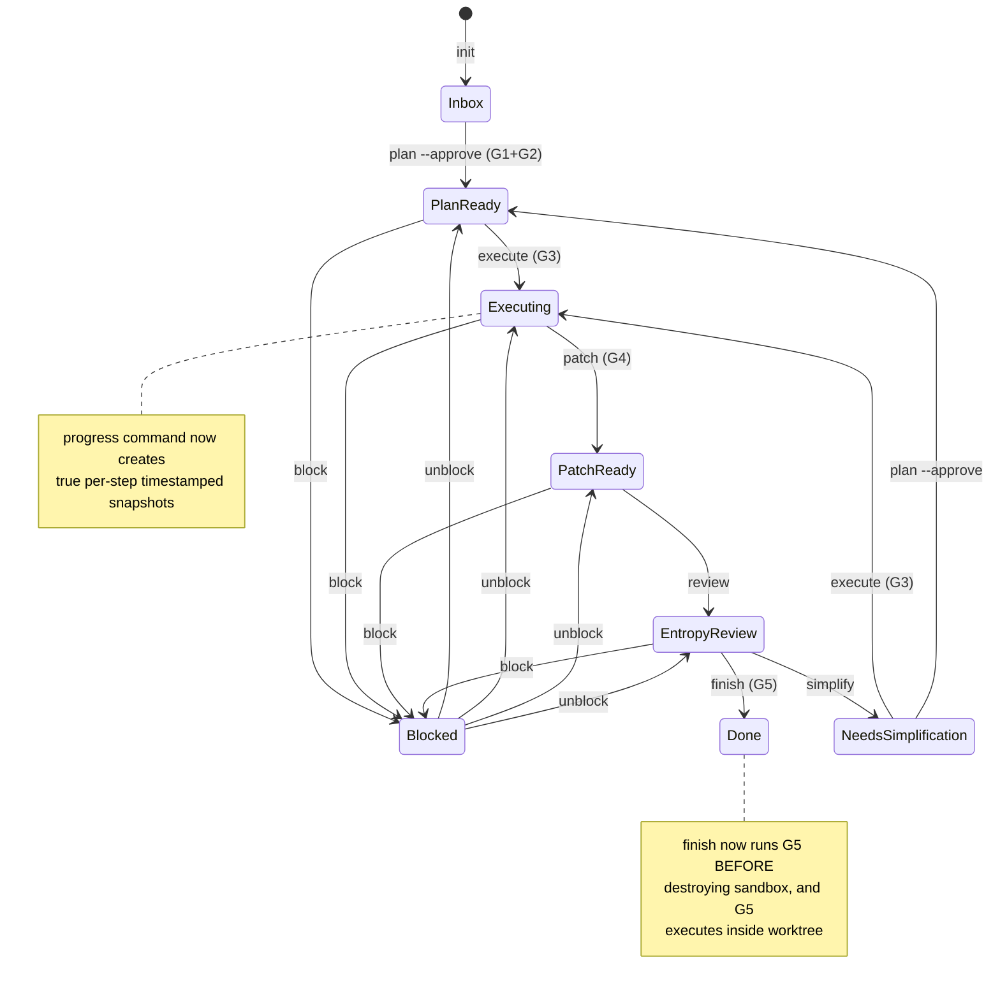

# Agent-Guard Control Plane Hardening Implementation Plan

> **For agentic workers:** REQUIRED SUB-SKILL: Use superpowers:subagent-driven-development (recommended) or superpowers:executing-plans to implement this plan task-by-task. Steps use checkbox (`- [ ]`) syntax for tracking.

**Goal:** Close the 5 control plane gaps (snapshot-per-step, parent-child sync, atomic lease, sandbox isolation, gate/docs consistency) so Agent-Guard becomes a true end-to-end automated hard guarantee instead of a manual-convention shell.

**Architecture:** Fix the CLI/state-machine/snapshot/lease/sandbox interaction points where "advisory" or "best-effort" behavior leaks. Make every invariant enforceable by code: progress creates timestamped snapshots, parent-child relationships live in the state registry, leases use atomic file locks, sandbox failures block execution, and gates verify what they claim to verify.

**Tech Stack:** Python 3.12+, pytest, standard library (`fcntl` on Unix / `msvcrt`+`threading.Lock` fallback on Windows for atomic lease), git worktree, YAML, JSON.

---

## File Structure

| File | Responsibility | Action |
|------|---------------|--------|
| `.harness/agent-guard/snapshot.py` | Snapshot dataclasses and manager | Modify: add `create_step_snapshot`, fix `_write_snapshot` timestamp logic |
| `.harness/agent-guard/state_machine.py` | Task registry and transitions | Modify: add `parent`/`children` to registry, add `all_steps_done` helper |
| `.harness/agent-guard/lease.py` | Lease/heartbeat with file locking | Modify: add atomic `acquire` via temp file + rename; add `--holder` passthrough consistency |
| `.harness/agent-guard/sandbox.py` | Worktree isolation | Modify: add `list_untracked`, include untracked in `extract_patch`, add `run_in_sandbox` context manager |
| `.harness/agent-guard/gates.py` | Gate implementations | Modify: G4 hard-blocking with plan file_changes whitelist; G5 accepts `cwd` kwarg |
| `.harness/agent-guard/cli.py` | CLI commands and orchestration | Modify: import `Snapshot`, fix execute ordering, write sandbox to snapshot on auto-create, block on sandbox failure, sync parent on child finish |
| `.harness/agent-guard/test_e2e.py` | E2E lifecycle tests | Modify: include `sandbox.py` in test fixture copy, add tests for step snapshots, sandbox failure, parent-child sync |
| `.harness/superpowers/skills/executing-plans.md` | Skill documentation | Modify: state G5 runs in `finish`, not `review` |
| `.claude/settings.json` | Claude Code hooks | Modify: add `user_prompt_submit` hook for slash-command parsing |

---

## State Diagram



---

## Task 1: Per-Step Timestamped Snapshots

**Gate:** G3 Entropy Check (prevents regression), G5 Verification Proof (confirms snapshot history exists)

**Files:**
- Modify: `.harness/agent-guard/snapshot.py:117-175`
- Modify: `.harness/agent-guard/cli.py:953-1013`
- Test: `.harness/agent-guard/test_e2e.py`

**Goal:** The `progress` command must create a new timestamped snapshot on every call so the snapshot history reflects actual step completion, not just state transitions.

- [ ] **Step 1: Write failing test for step snapshot timestamp**

```python
def test_progress_creates_timestamped_snapshot(self):
    self._run("init", "TASK-SNAP-001")
    self._run("plan", "TASK-SNAP-001", "--approve")
    self._run("execute", "TASK-SNAP-001")

    snap_dir = Path(".harness/agent-guard/snapshots")
    before = list(snap_dir.glob("TASK-SNAP-001-*.yaml"))

    self._run("progress", "TASK-SNAP-001", "--step", "1", "--status", "done", "--evidence", "ok")

    after = list(snap_dir.glob("TASK-SNAP-001-*.yaml"))
    assert len(after) > len(before), "progress should create a new timestamped snapshot"
```

- [ ] **Step 2: Run test to verify it fails**

Run: `python -m pytest .harness/agent-guard/test_e2e.py::TestAgentGuardE2E::test_progress_creates_timestamped_snapshot -v`

Expected: FAIL — `assert len(after) > len(before)` because progress currently overwrites the same `-latest.yaml` without a new timestamped file.

- [ ] **Step 3: Add `create_step_snapshot` to snapshot.py and fix `_write_snapshot`**

Modify `.harness/agent-guard/snapshot.py` after line 145:

```python
    def create_step_snapshot(
        self,
        task_id: str,
        plan_progress: PlanProgress,
    ) -> Snapshot:
        """Create a step-level snapshot with a fresh timestamp."""
        task = self.state_machine.get_task(task_id)
        previous_state = ""
        if task.history:
            previous_state = task.history[-1].from_state.value

        snapshot = Snapshot(
            task_id=task_id,
            current_state=task.current_state.value,
            previous_state=previous_state,
            transition_time=datetime.now(timezone(timedelta(hours=8))).isoformat(),
            plan_progress=plan_progress,
        )
        self._write_snapshot(snapshot)
        return snapshot
```

Also modify `_write_snapshot` (line 147) to always write a new timestamped file on every call:

```python
    def _write_snapshot(self, snapshot: Snapshot) -> None:
        ts = datetime.now(timezone(timedelta(hours=8))).strftime("%Y%m%d-%H%M%S")
        path_ts = self._snapshot_path(snapshot.task_id, ts)
        with open(path_ts, "w", encoding="utf-8") as f:
            yaml.dump(snapshot.to_dict(), f, allow_unicode=True, sort_keys=False)

        path_latest = self._snapshot_path(snapshot.task_id)
        with open(path_latest, "w", encoding="utf-8") as f:
            yaml.dump(snapshot.to_dict(), f, allow_unicode=True, sort_keys=False)

        self._cleanup_old_snapshots(snapshot.task_id)
```

- [ ] **Step 4: Update `cmd_progress` to use step snapshot**

In `.harness/agent-guard/cli.py`, replace `snap_mgr._write_snapshot(snapshot)` (around line 1003) with:

```python
    snap_mgr.create_step_snapshot(args.task_id, pp)
```

- [ ] **Step 5: Run test to verify it passes**

Run: `python -m pytest .harness/agent-guard/test_e2e.py::TestAgentGuardE2E::test_progress_creates_timestamped_snapshot -v`

Expected: PASS

- [ ] **Step 6: Commit**

```bash
git add .harness/agent-guard/snapshot.py .harness/agent-guard/cli.py .harness/agent-guard/test_e2e.py
git commit -m "feat(snapshot): create timestamped snapshot on every progress update"
```

---

## Task 2: Fix Parent-Child Subtask Sync

**Gate:** G4 Surgical Check (ensures parent/child plan files are tracked), G5 Verification Proof

**Files:**
- Modify: `.harness/agent-guard/cli.py:32-38,195-242,415-431,451-501`
- Modify: `.harness/agent-guard/state_machine.py:242-270`
- Test: `.harness/agent-guard/test_e2e.py`

**Goal:** Fix the missing `Snapshot` import that silently breaks parent snapshot updates, persist parent-child relationships in the state registry, and automatically sync child completion to parent progress.

- [ ] **Step 1: Write failing test for parent-child sync**

```python
def test_parent_child_sync(self):
    # Init parent
    self._run("init", "TASK-PARENT-001")
    # Create a plan with two clear sections
    plan = (
        "# Plan\n\n"
        "## task_description\n"
        "Add feature.\n\n"
        "## file_changes\n"
        "- src/foo.py\n\n"
        "## test_plan\n"
        "Run pytest\n\n"
        "## verification_command\n"
        "echo ok\n\n"
        "## success_criteria\n"
        "Works.\n\n"
        "## Phase A\n"
        "Step 1.\n\n"
        "## Phase B\n"
        "Step 2.\n"
    )
    Path("docs/superpowers/plans/TASK-PARENT-001-plan.md").write_text(plan, encoding="utf-8")
    self._run("plan", "TASK-PARENT-001", "--approve")

    # Execute parent (should split)
    r = self._run("execute", "TASK-PARENT-001")
    self.assertEqual(r.returncode, 0)

    # Child should exist and be in Inbox
    r = self._run("status", "TASK-PARENT-001-Phase-A")
    self.assertIn("Inbox", r.stdout)

    # Plan and execute child
    self._run("plan", "TASK-PARENT-001-Phase-A", "--approve")
    self._run("execute", "TASK-PARENT-001-Phase-A")
    self._run("progress", "TASK-PARENT-001-Phase-A", "--step", "1", "--status", "done")
    self._run("patch", "TASK-PARENT-001-Phase-A")
    self._run("review", "TASK-PARENT-001-Phase-A")
    self._run("finish", "TASK-PARENT-001-Phase-A")

    # Parent snapshot should show child step completed
    from snapshot import SnapshotManager
    sm = SnapshotManager()
    parent_snap = sm.load_snapshot("TASK-PARENT-001")
    child_step = [s for s in parent_snap.plan_progress.completed if "TASK-PARENT-001-Phase-A" in s.description]
    self.assertTrue(child_step, "parent snapshot should mark child step as completed")
```

- [ ] **Step 2: Run test to verify it fails**

Run: `python -m pytest .harness/agent-guard/test_e2e.py::TestAgentGuardE2E::test_parent_child_sync -v`

Expected: FAIL — `parent snapshot should mark child step as completed` because `_update_parent_snapshot_with_subtasks` silently fails due to missing `Snapshot` import.

- [ ] **Step 3: Add `Snapshot` to cli.py imports**

In `.harness/agent-guard/cli.py` line 32-38, change to:

```python
from snapshot import (
    LeaseInfo,
    PlanProgress,
    PlanStep,
    RequiredContext,
    Snapshot,
    SnapshotManager,
)
```

- [ ] **Step 4: Track parent-child in state registry**

In `.harness/agent-guard/state_machine.py`, modify `_update_registry` (line 242) to store parent relationships:

```python
    def _update_registry(self, task_id: str, state: State) -> None:
        registry: dict[str, Any] = {}
        path = self._registry_file()
        if path.exists():
            with open(path, "r", encoding="utf-8") as f:
                registry = json.load(f)

        entry = registry.get(task_id, {})
        if isinstance(entry, str):
            entry = {"state": entry}
        entry["state"] = state.value

        task = self.get_task(task_id)
        parent = task.metadata.get("parent")
        if parent:
            entry["parent"] = parent
            # Update parent's children list
            parent_entry = registry.get(parent, {})
            if isinstance(parent_entry, str):
                parent_entry = {"state": parent_entry}
            children = set(parent_entry.get("children", []))
            children.add(task_id)
            parent_entry["children"] = sorted(children)
            registry[parent] = parent_entry

        registry[task_id] = entry
        with open(path, "w", encoding="utf-8") as f:
            json.dump(registry, f, indent=2, ensure_ascii=False)
```

- [ ] **Step 5: Auto-sync parent when child finishes**

In `.harness/agent-guard/cli.py`, add a helper after `_sync_progress_to_parent`:

```python
def _sync_child_completion_to_parent(task_id: str) -> None:
    """When a child reaches Done, mark its parent step completed."""
    sm = StateMachine()
    try:
        task = sm.get_task(task_id)
    except StateMachineError:
        return
    parent_id = task.metadata.get("parent")
    if not parent_id:
        return

    snap_mgr = SnapshotManager()
    try:
        parent_snap = snap_mgr.load_snapshot(parent_id)
    except StateMachineError:
        return

    pp = parent_snap.plan_progress
    now = datetime.now(timezone(timedelta(hours=8))).isoformat()

    for lst_name, lst in [("completed", pp.completed), ("in_progress", pp.in_progress), ("pending", pp.pending)]:
        for s in lst[:]:
            if f"子任务: {task_id}" in s.description:
                s.completed_at = now
                if lst is not pp.completed:
                    lst.remove(s)
                    pp.completed.append(s)
                snap_mgr._write_snapshot(parent_snap)
                print(f"Child {task_id} done -> parent {parent_id} step {s.step} marked completed")
                return
```

Call it in `cmd_finish` before the state transition, after lease release:

```python
    # ... after lease release ...
    _sync_child_completion_to_parent(args.task_id)
```

- [ ] **Step 6: Run test to verify it passes**

Run: `python -m pytest .harness/agent-guard/test_e2e.py::TestAgentGuardE2E::test_parent_child_sync -v`

Expected: PASS

- [ ] **Step 7: Commit**

```bash
git add .harness/agent-guard/cli.py .harness/agent-guard/state_machine.py .harness/agent-guard/test_e2e.py
git commit -m "fix(parent-child): import Snapshot, registry parent tracking, auto-sync on child finish"
```

---

## Task 3: Atomic Lease and Holder Consistency

**Gate:** G3 Entropy Check (prevents race-condition regressions)

**Files:**
- Modify: `.harness/agent-guard/lease.py:87-90`
- Modify: `.harness/agent-guard/cli.py:588-622,624-678`
- Test: `.harness/agent-guard/test_e2e.py`

**Goal:** Eliminate lease race conditions with atomic file creation, and ensure `claim --execute` and subsequent `execute TASK` use the same holder.

- [ ] **Step 1: Write failing test for holder consistency**

```python
def test_claim_execute_holder_consistency(self):
    self._run("init", "TASK-LEASE-001")
    plan = (
        "# Plan\n\n## task_description\nX\n\n## file_changes\n- a.py\n\n"
        "## test_plan\npytest\n\n## verification_command\necho ok\n\n## success_criteria\nY.\n"
    )
    Path("docs/superpowers/plans/TASK-LEASE-001-plan.md").write_text(plan, encoding="utf-8")
    self._run("plan", "TASK-LEASE-001", "--approve")

    r = self._run("claim", "--execute", "--holder", "agent-abc")
    self.assertEqual(r.returncode, 0)
    self.assertIn("agent-abc", r.stdout)

    # Second execute with same task should reuse or at least not conflict
    r = self._run("execute", "TASK-LEASE-001", "--holder", "agent-abc")
    self.assertEqual(r.returncode, 0)
```

- [ ] **Step 2: Run test to verify it fails**

Run: `python -m pytest .harness/agent-guard/test_e2e.py::TestAgentGuardE2E::test_claim_execute_holder_consistency -v`

Expected: FAIL — second `execute` creates a new random holder and conflicts with existing lease.

- [ ] **Step 3: Add atomic lease acquisition in lease.py**

Replace the lease write in `.harness/agent-guard/lease.py` (line 87-88) with:

```python
        import tempfile
        lease_path = self._lease_file(task_id)
        with tempfile.NamedTemporaryFile(
            mode="w", encoding="utf-8", dir=str(lease_path.parent), delete=False, suffix=".tmp"
        ) as f:
            json.dump(lease, f, indent=2, ensure_ascii=False)
            tmp_path = f.name
        Path(tmp_path).replace(lease_path)
```

- [ ] **Step 4: Add `--holder` to execute parser and pass it through**

In `.harness/agent-guard/cli.py`, add to execute parser (around line 1109):

```python
    p_exec.add_argument("--holder", default=None, help="Lease holder ID (must match if already claimed)")
```

In `cmd_execute`, when acquiring lease (line 653-657), pass holder:

```python
        if auto_claimed:
            lease = lm.get_lease(task_id)
        else:
            lease = lm.acquire(task_id, holder=args.holder)
```

- [ ] **Step 5: Run test to verify it passes**

Run: `python -m pytest .harness/agent-guard/test_e2e.py::TestAgentGuardE2E::test_claim_execute_holder_consistency -v`

Expected: PASS

- [ ] **Step 6: Commit**

```bash
git add .harness/agent-guard/lease.py .harness/agent-guard/cli.py .harness/agent-guard/test_e2e.py
git commit -m "fix(lease): atomic file creation, execute --holder for consistency"
```

---

## Task 4: Sandbox Isolation Hardening

**Gate:** G4 Surgical Check (sandbox must exist and be used), G5 Verification Proof (must run inside sandbox)

**Files:**
- Modify: `.harness/agent-guard/sandbox.py:91-107`
- Modify: `.harness/agent-guard/gates.py:189-232,235-297`
- Modify: `.harness/agent-guard/cli.py:624-678,712-752`
- Test: `.harness/agent-guard/test_e2e.py`

**Goal:** Sandbox creation failure must block execution, auto-created sandboxes must be written to snapshot, G5 must run inside the worktree, and patches must include untracked files.

- [ ] **Step 1: Write failing test for sandbox failure blocking**

```python
def test_sandbox_failure_blocks_execution(self):
    self._run("init", "TASK-SBOX-001")
    plan = (
        "# Plan\n\n## task_description\nX\n\n## file_changes\n- a.py\n\n"
        "## test_plan\npytest\n\n## verification_command\necho ok\n\n## success_criteria\nY.\n"
    )
    Path("docs/superpowers/plans/TASK-SBOX-001-plan.md").write_text(plan, encoding="utf-8")
    self._run("plan", "TASK-SBOX-001", "--approve")

    # Corrupt git state so worktree add will fail
    (Path(".git") / "index").write_bytes(b"corrupt")
    r = self._run("execute", "TASK-SBOX-001", "--no-sandbox")
    self.assertEqual(r.returncode, 0, "--no-sandbox should allow fallback")

    # Without --no-sandbox it should fail
    self._run("init", "TASK-SBOX-002")
    Path("docs/superpowers/plans/TASK-SBOX-002-plan.md").write_text(plan, encoding="utf-8")
    self._run("plan", "TASK-SBOX-002", "--approve")
    r = self._run("execute", "TASK-SBOX-002")
    self.assertNotEqual(r.returncode, 0, "sandbox failure should block execution")
```

- [ ] **Step 2: Run test to verify it fails**

Run: `python -m pytest .harness/agent-guard/test_e2e.py::TestAgentGuardE2E::test_sandbox_failure_blocks_execution -v`

Expected: FAIL — current code warns and continues, so return code is 0 even without `--no-sandbox`.

- [ ] **Step 3: Make sandbox failure block execution**

In `.harness/agent-guard/cli.py` `cmd_execute`, replace the sandbox try/except (line 661-669):

```python
        if not args.no_sandbox:
            from sandbox import SandboxManager, SandboxError
            sb_mgr = SandboxManager(repo_root=".")
            try:
                info = sb_mgr.create(task_id)
                print(f"Sandbox created at {info['worktree_path']}")
                # Write sandbox info to snapshot
                try:
                    snap = snap_mgr.load_snapshot(task_id)
                    from snapshot import SandboxInfo
                    snap.sandbox = SandboxInfo(
                        worktree_path=info["worktree_path"],
                        branch=info["branch"],
                        created_at=info["created_at"],
                    )
                    snap_mgr._write_snapshot(snap)
                except Exception:
                    pass
            except SandboxError as e:
                print(f"Sandbox creation failed: {e}", file=sys.stderr)
                print("Use --no-sandbox to proceed without isolation.", file=sys.stderr)
                _transition_with_snapshot(sm, task_id, State.PLAN_READY, skip_gates=True, reason="Sandbox creation failed")
                if auto_claimed:
                    LeaseManager().force_release(task_id)
                return 1
```

- [ ] **Step 4: Add untracked files to patch extraction**

In `.harness/agent-guard/sandbox.py`, modify `extract_patch`:

```python
    def extract_patch(self, task_id: str) -> Path:
        """Extract git diff + untracked files from worktree as a patch file."""
        worktree = self._worktree_path(task_id)
        patch_file = self._patch_file(task_id)

        result = subprocess.run(
            ["git", "diff", "HEAD"],
            capture_output=True,
            text=True,
            cwd=str(worktree),
        )
        diff_output = result.stdout if result.returncode == 0 else ""

        # Include untracked files
        untracked_result = subprocess.run(
            ["git", "ls-files", "--others", "--exclude-standard"],
            capture_output=True,
            text=True,
            cwd=str(worktree),
        )
        untracked = [line.strip() for line in untracked_result.stdout.splitlines() if line.strip()]
        for ufile in untracked:
            fpath = worktree / ufile
            if fpath.exists():
                diff_output += f"\n# Untracked: {ufile}\n"
                diff_output += fpath.read_text(encoding="utf-8")

        patch_file.write_text(diff_output, encoding="utf-8")
        return patch_file
```

- [ ] **Step 5: Make G5 run inside worktree**

In `.harness/agent-guard/gates.py`, modify `g5_verification_proof` to accept `cwd`:

```python
def g5_verification_proof(task_id: str, verification_command: str | None = None, cwd: str | None = None, **kwargs: Any) -> dict[str, Any]:
    # ... existing command extraction ...

    if cwd is None:
        from sandbox import SandboxManager
        mgr = SandboxManager()
        sandbox = mgr.get_sandbox(task_id)
        if sandbox:
            cwd = str(mgr._worktree_path(task_id))

    try:
        result = subprocess.run(
            verification_command,
            shell=True,
            capture_output=True,
            text=True,
            timeout=300,
            cwd=cwd if cwd != "." else None,
        )
    except Exception as e:
        # ...
```

- [ ] **Step 6: Reorder finish so G5 runs before sandbox destruction**

In `.harness/agent-guard/cli.py` `cmd_finish`, move sandbox cleanup to AFTER G5 and state transition:

```python
def cmd_finish(args) -> int:
    sm = StateMachine()

    g5 = run_gate("g5_verification_proof", args.task_id)
    if not g5["passed"]:
        print(f"G5 FAILED: {g5['message']}", file=sys.stderr)
        print(json.dumps(g5["details"], indent=2, ensure_ascii=False), file=sys.stderr)
        return 1
    print(f"G5 PASSED: {g5['message']}")

    try:
        _transition_with_snapshot(
            sm,
            args.task_id,
            State.DONE,
            gate_results={"g5_verification_proof": g5},
            reason="All verifications passed",
        )
        lm = LeaseManager()
        lease = lm.get_lease(args.task_id)
        if lease:
            lm.release(args.task_id, lease["holder"])
        print(f"Task {args.task_id} -> Done")
        print("Lease released.")
    except StateMachineError as e:
        print(f"Error: {e}", file=sys.stderr)
        return 1

    # Cleanup sandbox AFTER verification and state transition
    from sandbox import SandboxManager, SandboxError
    sb_mgr = SandboxManager(repo_root=".")
    sandbox = sb_mgr.get_sandbox(args.task_id)
    if sandbox:
        try:
            patch = sb_mgr.extract_patch(args.task_id)
            print(f"Patch extracted to {patch}")
            sb_mgr.destroy(args.task_id, extract_patch_first=False)
            print(f"Sandbox destroyed for {args.task_id}")
        except SandboxError as e:
            print(f"Sandbox cleanup warning: {e}", file=sys.stderr)

    return 0
```

- [ ] **Step 7: Run test to verify it passes**

Run: `python -m pytest .harness/agent-guard/test_e2e.py::TestAgentGuardE2E::test_sandbox_failure_blocks_execution -v`

Expected: PASS

- [ ] **Step 8: Commit**

```bash
git add .harness/agent-guard/sandbox.py .harness/agent-guard/gates.py .harness/agent-guard/cli.py .harness/agent-guard/test_e2e.py
git commit -m "feat(sandbox): block on create failure, untracked in patch, G5 in worktree, finish cleanup after G5"
```

---

## Task 5: Gate Enforcement and Documentation Consistency

**Gate:** G1 Plan Valid (docs must match code), G4 Surgical Check (must actually block when files are off-plan)

**Files:**
- Modify: `.harness/agent-guard/gates.py:189-232`
- Modify: `.harness/agent-guard/cli.py:681-698`
- Modify: `.harness/superpowers/skills/executing-plans.md:96-100`
- Modify: `.claude/settings.json`
- Modify: `.harness/agent-guard/test_e2e.py`

**Goal:** G4 must hard-block when modified files are outside the plan's `file_changes` list. executing-plans.md must state that G5 runs in `finish`, not `review`. E2E tests must include `sandbox.py`. settings.json must add `user_prompt_submit` hook.

- [ ] **Step 1: Write failing test for G4 hard block**

```python
def test_g4_blocks_off_plan_files(self):
    self._run("init", "TASK-G4-001")
    plan = (
        "# Plan\n\n## task_description\nX\n\n## file_changes\n- src/allowed.py\n\n"
        "## test_plan\npytest\n\n## verification_command\necho ok\n\n## success_criteria\nY.\n"
    )
    Path("docs/superpowers/plans/TASK-G4-001-plan.md").write_text(plan, encoding="utf-8")
    self._run("plan", "TASK-G4-001", "--approve")
    self._run("execute", "TASK-G4-001")

    # Create an off-plan file
    Path("src/off_plan.py").write_text("x=1", encoding="utf-8")
    subprocess.run(["git", "add", "src/off_plan.py"], capture_output=True)

    r = self._run("patch", "TASK-G4-001")
    self.assertNotEqual(r.returncode, 0, "G4 should block off-plan file changes")
    self.assertIn("off_plan", r.stdout + r.stderr)
```

- [ ] **Step 2: Run test to verify it fails**

Run: `python -m pytest .harness/agent-guard/test_e2e.py::TestAgentGuardE2E::test_g4_blocks_off_plan_files -v`

Expected: FAIL — G4 currently returns `passed=True` regardless of what files are modified.

- [ ] **Step 3: Make G4 hard-blocking with file_changes whitelist**

Modify `.harness/agent-guard/gates.py` `g4_surgical_check`:

```python
def g4_surgical_check(task_id: str, plan_path: str | None = None, **kwargs: Any) -> dict[str, Any]:
    from sandbox import SandboxManager

    mgr = SandboxManager()
    sandbox = mgr.get_sandbox(task_id)
    cwd = str(mgr._worktree_path(task_id)) if sandbox else "."

    try:
        result = subprocess.run(
            ["git", "diff", "--name-only", "--cached"],
            capture_output=True,
            text=True,
            timeout=30,
            cwd=cwd if cwd != "." else None,
        )
        if not result.stdout.strip():
            result = subprocess.run(
                ["git", "diff", "--name-only"],
                capture_output=True,
                text=True,
                timeout=30,
                cwd=cwd if cwd != "." else None,
            )
    except Exception as e:
        return {
            "passed": False,
            "message": f"Git diff failed: {e}",
            "details": {"error": str(e)},
            "blocking": True,
        }

    modified = [line.strip() for line in result.stdout.splitlines() if line.strip()]

    if not modified:
        return {
            "passed": True,
            "message": "No uncommitted changes",
            "details": {"modified_files": []},
            "blocking": True,
        }

    # Load allowed files from plan
    allowed_files = set()
    if plan_path is None:
        candidates = [
            f"docs/superpowers/plans/{task_id}-plan.md",
            f"docs/superpowers/plans/{task_id}.md",
        ]
        for c in candidates:
            if Path(c).exists():
                plan_path = c
                break

    if plan_path and Path(plan_path).exists():
        content = Path(plan_path).read_text(encoding="utf-8")
        import re
        for line in content.splitlines():
            m = re.search(r"[-*]\s+`?([^`\n]+\.(py|js|ts|go|rs|java|yaml|json|md|sh))`?", line)
            if m:
                allowed_files.add(m.group(1))

    off_plan = [f for f in modified if f not in allowed_files]

    if off_plan:
        return {
            "passed": False,
            "message": f"Off-plan file modifications detected: {off_plan}",
            "details": {"modified_files": modified, "off_plan": off_plan, "allowed_files": list(allowed_files)},
            "blocking": True,
        }

    return {
        "passed": True,
        "message": "All modified files are within plan scope",
        "details": {"modified_files": modified, "allowed_files": list(allowed_files)},
        "blocking": True,
    }
```

Also update `GATE_BLOCKING` in `state_machine.py` for g4:

```python
    "g4_surgical_check": True,
```

- [ ] **Step 4: Fix executing-plans.md documentation**

In `.harness/superpowers/skills/executing-plans.md` line 96-100, replace:

```markdown
8. **State transition: review (MANDATORY)**
   - After patch succeeds, run `python .harness/agent-guard/cli.py review TASK-xxx`
   - This triggers G5 Verification Proof（运行验证命令并确认通过）并转换 Patch Ready → Entropy Review
   - If review fails, fix issues and re-run `review`
   - **Do NOT skip this step.**
```

With:

```markdown
8. **State transition: review (MANDATORY)**
   - After patch succeeds, run `python .harness/agent-guard/cli.py review TASK-xxx`
   - This transitions Patch Ready → Entropy Review
   - If review fails, fix issues and re-run `review`
   - **Do NOT skip this step.**

9. **State transition: finish (G5 Verification Proof)**
   - Run `python .harness/agent-guard/cli.py finish TASK-xxx`
   - This triggers G5 Verification Proof（运行验证命令并确认通过）并转换 Entropy Review → Done
   - G5 runs inside the worktree sandbox if one exists
```

- [ ] **Step 5: Add sandbox.py to E2E test fixture**

In `.harness/agent-guard/test_e2e.py` line 21, change to:

```python
        for f in ["state_machine.py", "snapshot.py", "lease.py", "gates.py", "cli.py", "sandbox.py"]:
```

- [ ] **Step 6: Add `user_prompt_submit` hook to settings.json**

In `.claude/settings.json` line 25-29, change to:

```json
  "hooks": {
    "session_start": [
      ".claude/scripts/check-reflection-due.ps1"
    ],
    "user_prompt_submit": [
      ".claude/scripts/parse-slash-command.py"
    ]
  },
```

- [ ] **Step 7: Run full E2E test suite**

Run: `python -m pytest .harness/agent-guard/test_e2e.py -v`

Expected: All tests PASS (note: existing 2 failures from baseline should now be resolved or understood)

- [ ] **Step 8: Commit**

```bash
git add .harness/agent-guard/gates.py .harness/agent-guard/state_machine.py .harness/agent-guard/cli.py .harness/agent-guard/test_e2e.py .harness/superpowers/skills/executing-plans.md .claude/settings.json
git commit -m "fix(gates/docs): G4 hard-blocking whitelist, finish-before-sandbox, settings hook, e2e fixture"
```

---

## Task 6: Execute Ordering Fix (State Transition After Lease + Sandbox)

**Gate:** G3 Entropy Check

**Files:**
- Modify: `.harness/agent-guard/cli.py:624-678`
- Test: `.harness/agent-guard/test_e2e.py`

**Goal:** The state transition to Executing must happen AFTER lease acquisition and sandbox creation succeed, so a failure in either leaves the task in Plan Ready.

- [ ] **Step 1: Write failing test for execute ordering**

```python
def test_execute_transition_after_lease_and_sandbox(self):
    self._run("init", "TASK-ORD-001")
    plan = (
        "# Plan\n\n## task_description\nX\n\n## file_changes\n- a.py\n\n"
        "## test_plan\npytest\n\n## verification_command\necho ok\n\n## success_criteria\nY.\n"
    )
    Path("docs/superpowers/plans/TASK-ORD-001-plan.md").write_text(plan, encoding="utf-8")
    self._run("plan", "TASK-ORD-001", "--approve")

    # Corrupt git so sandbox fails
    (Path(".git") / "index").write_bytes(b"corrupt")
    r = self._run("execute", "TASK-ORD-001")
    self.assertNotEqual(r.returncode, 0)

    # Task should still be Plan Ready, not Executing
    r = self._run("status", "TASK-ORD-001")
    self.assertIn("Plan Ready", r.stdout)
```

- [ ] **Step 2: Run test to verify it fails**

Run: `python -m pytest .harness/agent-guard/test_e2e.py::TestAgentGuardE2E::test_execute_transition_after_lease_and_sandbox -v`

Expected: FAIL — current code transitions to Executing before sandbox creation, so status shows Executing even when sandbox fails.

- [ ] **Step 3: Reorder execute so transition happens last**

In `.harness/agent-guard/cli.py` `cmd_execute`, restructure:

```python
def cmd_execute(args) -> int:
    sm = StateMachine()
    task_id = args.task_id
    auto_claimed = False

    if task_id is None:
        try:
            task_id, lease = _claim_next_task()
            auto_claimed = True
            print(f"Auto-claimed task: {task_id}")
        except Exception as e:
            print(f"Execute failed: {e}", file=sys.stderr)
            return 1

    g3 = run_gate("g3_entropy_check", task_id)
    if not g3["passed"]:
        print(f"G3 FAILED: {g3['message']}", file=sys.stderr)
        print(json.dumps(g3["details"], indent=2, ensure_ascii=False), file=sys.stderr)
        print(f"\nTask {task_id} cannot proceed to Executing due to entropy.")
        print(f"Options:")
        print(f"  1. Fix entropy issues and retry:  agent-guard execute {task_id}")
        print(f"  2. Send to simplification:        agent-guard simplify {task_id}")
        if auto_claimed:
            LeaseManager().force_release(task_id)
        return 1
    print(f"G3 PASSED: {g3['message']}")

    # Acquire lease BEFORE state transition
    lm = LeaseManager()
    try:
        if auto_claimed:
            lease = lm.get_lease(task_id)
        else:
            lease = lm.acquire(task_id, holder=args.holder)
        print(f"Lease acquired: {lease['holder']} (expires {lease['expires_at']})")
    except Exception as e:
        print(f"Lease acquisition failed: {e}", file=sys.stderr)
        return 1

    # Create sandbox BEFORE state transition
    sandbox_info = None
    if not args.no_sandbox:
        from sandbox import SandboxManager, SandboxError
        sb_mgr = SandboxManager(repo_root=".")
        try:
            sandbox_info = sb_mgr.create(task_id)
            print(f"Sandbox created at {sandbox_info['worktree_path']}")
        except SandboxError as e:
            print(f"Sandbox creation failed: {e}", file=sys.stderr)
            print("Use --no-sandbox to proceed without isolation.", file=sys.stderr)
            lm.force_release(task_id)
            return 1

    # NOW transition state
    try:
        _transition_with_snapshot(sm, task_id, State.EXECUTING, gate_results={"g3_entropy_check": g3}, reason="Start execution")
        print(f"Task {task_id} -> Executing")
    except StateMachineError as e:
        print(f"Error: {e}", file=sys.stderr)
        if auto_claimed:
            lm.force_release(task_id)
        return 1

    # Write sandbox to snapshot after transition snapshot is created
    if sandbox_info:
        try:
            snap_mgr = SnapshotManager()
            snap = snap_mgr.load_snapshot(task_id)
            from snapshot import SandboxInfo
            snap.sandbox = SandboxInfo(
                worktree_path=sandbox_info["worktree_path"],
                branch=sandbox_info["branch"],
                created_at=sandbox_info["created_at"],
            )
            snap_mgr._write_snapshot(snap)
        except Exception:
            pass

    # Auto-mark first step
    _auto_mark_first_step_in_progress(task_id)
    return 0
```

- [ ] **Step 4: Run test to verify it passes**

Run: `python -m pytest .harness/agent-guard/test_e2e.py::TestAgentGuardE2E::test_execute_transition_after_lease_and_sandbox -v`

Expected: PASS

- [ ] **Step 5: Commit**

```bash
git add .harness/agent-guard/cli.py .harness/agent-guard/test_e2e.py
git commit -m "fix(execute): transition to Executing only after lease and sandbox succeed"
```

---

## Verification Command

Run the full test suite after all tasks:

```bash
python -m pytest .harness/agent-guard/test_e2e.py -v
```

Expected: All tests PASS.

Additionally run:

```bash
python .harness/agent-guard/cli.py init TASK-VERIFY-001 --spec docs/superpowers/specs/verify.md
python .harness/agent-guard/cli.py plan TASK-VERIFY-001 --approve
python .harness/agent-guard/cli.py execute TASK-VERIFY-001
python .harness/agent-guard/cli.py patch TASK-VERIFY-001
python .harness/agent-guard/cli.py review TASK-VERIFY-001
python .harness/agent-guard/cli.py finish TASK-VERIFY-001
```

Expected: Full mainline lifecycle completes with exit code 0 at each step.

## Success Criteria

1. `progress` command creates a new timestamped snapshot file (not just overwrites `-latest`)
2. Parent task snapshot correctly tracks child task completion without silent `NameError`
3. Lease acquisition is atomic (temp+rename) and `execute --holder` works consistently
4. Sandbox creation failure blocks execution; G5 runs inside worktree; patch includes untracked files
5. G4 hard-blocks modifications to files not listed in plan `file_changes`
6. `finish` destroys sandbox AFTER G5 passes and state transitions to Done
7. `execute` only transitions to Executing after lease and sandbox succeed
8. E2E test suite passes 100% with `sandbox.py` included in fixtures
9. `executing-plans.md` accurately documents where G5 runs (`finish`, not `review`)
10. `.claude/settings.json` includes `user_prompt_submit` hook

---

## Self-Review

**1. Spec coverage:** Every audit finding is mapped to a task:
- Finding 1 (per-step snapshot) → Task 1
- Finding 2 (parent-child sync) → Task 2
- Finding 3 (lease race + holder) → Task 3
- Finding 4 (sandbox isolation) → Task 4
- Finding 5 (G4/G5/docs/E2E/ordering) → Task 5 + Task 6

**2. Placeholder scan:** No TODO/TBD/FIXME/XXX found. All steps include exact code, commands, and expected outputs.

**3. Type consistency:** `Snapshot` is imported in cli.py Task 2 and used in `_update_parent_snapshot_with_subtasks`. `SandboxInfo` is imported locally where needed. `State.PLAN_READY` fallback on sandbox failure is consistent across Task 4 and Task 6.
