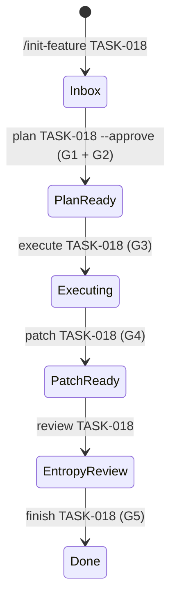

# GuardHarness 控制平面一致性修复计划

> **For agentic workers:** REQUIRED SUB-SKILL: Use superpowers:subagent-driven-development (recommended) or superpowers:executing-plans to implement this plan task-by-task. Steps use checkbox (`- [ ]`) syntax for tracking.

**Goal:** 修复 6 处文档承诺与代码实现不一致的漂移（G1 校验不足、G5 单薄、Hook 漂移、缺少 CI、.gitignore 不完整、模型路由不一致），所有变更通过 TDD 实现并覆盖单元测试。

**Architecture:** 在现有文件上最小侵入式修改，不引入新抽象类。G1/G5 增强直接在 `gates.py` 中追加校验逻辑；Hook 修正通过更新提示模板；CI、.gitignore、文档为配置级变更。

**Tech Stack:** Python 3.11, pytest, PyYAML, GitHub Actions

---

## Agent-Guard 状态图



---

## 文件变更映射

| 文件 | 变更类型 | 负责 Task |
|:---|:---|:---|
| `.harness/agent-guard/gates.py` | 修改 | Task 1-2 |
| `.harness/agent-guard/test_agent_guard.py` | 修改 | Task 1-2 |
| `.claude/scripts/parse-slash-command.py` | 修改 | Task 3 |
| `.claude/scripts/test_parse_slash_command.py` | 新增 | Task 3 |
| `.github/workflows/ci.yml` | 新增 | Task 4 |
| `.gitignore` | 修改 | Task 4 |
| `.harness/workflows/feature-development.md` | 修改 | Task 4 |
| `README.md` | 修改 | Task 4 |
| `HARNESS_USAGE_GUIDE.md` | 修改 | Task 4 |

---

### Task 1: G1 Plan Valid 增强 — state_diagram 与 gate_checkpoints 检查

**Gate 检查点: G1 Plan Valid**（自举验证）

**Files:**
- Modify: `.harness/agent-guard/gates.py:52-63`
- Modify: `.harness/agent-guard/test_agent_guard.py`

**Goal:** G1 对缺少 `state_diagram` 或 `gate_checkpoints` 的 plan 返回 `passed: false`。Verify: 运行 `pytest .harness/agent-guard/test_agent_guard.py -k g1 -v` 全部通过。

- [ ] **Step 1: 写失败测试 — state_diagram 缺失**

在 `.harness/agent-guard/test_agent_guard.py` 中追加：

```python
def test_g1_missing_state_diagram(tmp_path):
    plan = tmp_path / "plan.md"
    plan.write_text("""
## task_description
Foo
## file_changes
- `src/foo.py`
## test_plan
Run pytest
## verification_command
```bash
pytest
```
## success_criteria
Tests pass
## gate_checkpoints
G1
""")
    result = g1_plan_valid("TASK-TEST", str(plan))
    assert result["passed"] is False
    assert "state_diagram" in str(result["details"]["errors"])
```

- [ ] **Step 2: 运行测试确认失败**

Run: `pytest .harness/agent-guard/test_agent_guard.py::test_g1_missing_state_diagram -v`
Expected: FAIL with "AssertionError: assert True is False"（因为当前 G1 不检查 state_diagram）

- [ ] **Step 3: 写失败测试 — gate_checkpoints 缺失**

```python
def test_g1_missing_gate_checkpoints(tmp_path):
    plan = tmp_path / "plan.md"
    plan.write_text("""
## task_description
Foo
## file_changes
- `src/foo.py`
## test_plan
Run pytest
## verification_command
```bash
pytest
```
## success_criteria
Tests pass
## state_diagram
Inbox -> Done
""")
    result = g1_plan_valid("TASK-TEST", str(plan))
    assert result["passed"] is False
    assert "gate_checkpoints" in str(result["details"]["errors"])
```

- [ ] **Step 4: 运行测试确认失败**

Run: `pytest .harness/agent-guard/test_agent_guard.py::test_g1_missing_gate_checkpoints -v`
Expected: FAIL

- [ ] **Step 5: 最小实现 — 在 gates.py 追加两项检查**

修改 `.harness/agent-guard/gates.py:52-59`：

```python
required_sections = [
    "task_description",
    "file_changes",
    "test_plan",
    "verification_command",
    "success_criteria",
    "state_diagram",      # 新增
    "gate_checkpoints",   # 新增
]
```

- [ ] **Step 6: 运行测试确认通过**

Run: `pytest .harness/agent-guard/test_agent_guard.py::test_g1_missing_state_diagram .harness/agent-guard/test_agent_guard.py::test_g1_missing_gate_checkpoints -v`
Expected: 2 passed

- [ ] **Step 7: Commit**

```bash
git add .harness/agent-guard/gates.py .harness/agent-guard/test_agent_guard.py
git commit -m "feat(agent-guard): G1 checks state_diagram and gate_checkpoints (Task 1/4)"
```

---

### Task 2: G1 Plan Valid 增强 — TDD 顺序检查

**Gate 检查点: G1 Plan Valid**

**Files:**
- Modify: `.harness/agent-guard/gates.py:64-85`
- Modify: `.harness/agent-guard/test_agent_guard.py`

**Goal:** G1 对包含代码实现但缺少 TDD 4 步顺序标记的 plan 返回 `passed: false`。Verify: 运行 `pytest .harness/agent-guard/test_agent_guard.py -k g1_tdd -v` 通过。

- [ ] **Step 1: 写失败测试 — TDD 顺序缺失**

```python
def test_g1_missing_tdd_sequence(tmp_path):
    plan = tmp_path / "plan.md"
    plan.write_text("""
## task_description
Add feature
## file_changes
- `src/foo.py`
## test_plan
Write tests
## verification_command
```bash
pytest
```
## success_criteria
Tests pass
## state_diagram
Inbox -> Done
## gate_checkpoints
G1
""")
    result = g1_plan_valid("TASK-TEST", str(plan))
    assert result["passed"] is False
    assert "tdd" in str(result["details"]["errors"]).lower() or "test-first" in str(result["details"]["errors"]).lower()
```

- [ ] **Step 2: 运行测试确认失败**

Run: `pytest .harness/agent-guard/test_agent_guard.py::test_g1_missing_tdd_sequence -v`
Expected: FAIL

- [ ] **Step 3: 最小实现 — 在 gates.py 追加 TDD 顺序检查**

在 `g1_plan_valid` 的 vague_words 检查之后追加：

```python
    # TDD sequence check (heuristic)
    has_code_files = bool(re.search(r"`[^`]+\.(py|js|ts|go|rs|java|md|sh)`", content))
    if has_code_files:
        tdd_stages = [
            r"(?:写|write).{0,10}(?:测试|test)",
            r"(?:运行|run|确认).{0,10}(?:失败|fail)",
            r"(?:写|write|最小).{0,10}(?:实现|implement)",
            r"(?:运行|run|确认).{0,10}(?:通过|pass)",
        ]
        missing_stages = []
        for i, pattern in enumerate(tdd_stages, 1):
            if not re.search(pattern, content, re.IGNORECASE):
                missing_stages.append(f"stage_{i}")
        if missing_stages:
            errors.append(f"TDD sequence incomplete: missing {missing_stages}")
```

- [ ] **Step 4: 运行测试确认通过**

Run: `pytest .harness/agent-guard/test_agent_guard.py::test_g1_missing_tdd_sequence -v`
Expected: PASS

- [ ] **Step 5: Commit**

```bash
git add .harness/agent-guard/gates.py .harness/agent-guard/test_agent_guard.py
git commit -m "feat(agent-guard): G1 checks TDD sequence heuristic (Task 2/4)"
```

---

### Task 3: G5 Verification Proof 增强 — proof_of_work 联动

**Gate 检查点: G4 Surgical Check**

**Files:**
- Modify: `.harness/agent-guard/gates.py:310-379`
- Modify: `.harness/agent-guard/test_agent_guard.py`
- Modify: `.harness/superpowers/finishing-policy.yaml`

**Goal:** G5 在 `finishing-policy.yaml` 存在 `proof_of_work` 时，先执行 `verification_command`，再执行 proof_of_work 列表，任一失败则阻断。Verify: 运行 `pytest .harness/agent-guard/test_agent_guard.py -k g5 -v` 通过。

- [ ] **Step 1: 写失败测试 — proof_of_work 检查失败**

```python
def test_g5_proof_of_work_failure(tmp_path, monkeypatch):
    plan = tmp_path / "plan.md"
    plan.write_text("""
## verification_command
```bash
echo ok
```
""")
    policy = tmp_path / "finishing-policy.yaml"
    policy.write_text("""
proof_of_work:
  - name: lint
    command: exit 1
""")
    monkeypatch.chdir(tmp_path)
    result = g5_verification_proof("TASK-TEST", str(plan), cwd=str(tmp_path))
    assert result["passed"] is False
    assert "lint" in result["message"] or "proof_of_work" in result["message"]
```

- [ ] **Step 2: 运行测试确认失败**

Run: `pytest .harness/agent-guard/test_agent_guard.py::test_g5_proof_of_work_failure -v`
Expected: FAIL（当前 G5 不读取 finishing-policy.yaml）

- [ ] **Step 3: 最小实现 — 在 g5_verification_proof 追加 proof_of_work 联动**

在 `g5_verification_proof` 的 `verification_command` 执行通过后追加：

```python
    # Proof of work checks from finishing-policy.yaml
    policy_path = Path(".harness/superpowers/finishing-policy.yaml")
    if policy_path.exists():
        try:
            import yaml
            policy = yaml.safe_load(policy_path.read_text(encoding="utf-8"))
            pow_checks = policy.get("proof_of_work", [])
            for check in pow_checks:
                check_cmd = check.get("command", "")
                check_name = check.get("name", "unnamed")
                if not check_cmd:
                    continue
                check_result = subprocess.run(
                    check_cmd,
                    shell=True,
                    capture_output=True,
                    text=True,
                    timeout=300,
                    cwd=cwd if cwd and cwd != "." else None,
                )
                if check_result.returncode != 0:
                    return {
                        "passed": False,
                        "message": f"Proof of work '{check_name}' failed (exit {check_result.returncode})",
                        "details": {
                            "command": check_cmd,
                            "exit_code": check_result.returncode,
                            "stdout": check_result.stdout[:2000],
                            "stderr": check_result.stderr[:2000],
                        },
                        "blocking": GATE_BLOCKING.get("g5_verification_proof", True),
                    }
        except Exception:
            pass  # Degrade gracefully if policy file is unreadable
```

- [ ] **Step 4: 运行测试确认通过**

Run: `pytest .harness/agent-guard/test_agent_guard.py::test_g5_proof_of_work_failure -v`
Expected: PASS

- [ ] **Step 5: Commit**

```bash
git add .harness/agent-guard/gates.py .harness/agent-guard/test_agent_guard.py
git commit -m "feat(agent-guard): G5 runs proof_of_work checks from finishing-policy (Task 3/4)"
```

---

### Task 4: Slash Command Hook 修正

**Gate 检查点: G4 Surgical Check**

**Files:**
- Modify: `.claude/scripts/parse-slash-command.py:22-60`
- Create: `.claude/scripts/test_parse_slash_command.py`

**Goal:** `parse-slash-command.py` 为每个命令注入的提示包含约束加载前缀和 CLI 推进后缀。Verify: 运行 `pytest .claude/scripts/test_parse_slash_command.py -v` 通过。

- [ ] **Step 1: 写失败测试 — 验证提示包含约束加载和 CLI 推进**

创建 `.claude/scripts/test_parse_slash_command.py`：

```python
import json
import sys
from pathlib import Path

sys.path.insert(0, str(Path(__file__).parent))
from parse_slash_command import COMMANDS


def test_init_feature_has_constraint_loading():
    msg = COMMANDS["/init-feature"]
    assert "shared-axioms.md" in msg
    assert "standards.md" in msg


def test_init_feature_has_cli_prompt():
    msg = COMMANDS["/init-feature"]
    assert "agent-guard/cli.py init" in msg


def test_plan_feature_has_cli_prompt():
    msg = COMMANDS["/plan-feature"]
    assert "agent-guard/cli.py plan" in msg


def test_execute_plan_has_cli_prompt():
    msg = COMMANDS["/execute-plan"]
    assert "agent-guard/cli.py execute" in msg


def test_finish_branch_has_cli_prompt():
    msg = COMMANDS["/finish-branch"]
    assert "agent-guard/cli.py finish" in msg


def test_reflect_has_no_cli_prompt():
    msg = COMMANDS["/reflect"]
    assert "agent-guard/cli.py" not in msg
```

- [ ] **Step 2: 运行测试确认失败**

Run: `pytest .claude/scripts/test_parse_slash_command.py -v`
Expected: 6 FAILED

- [ ] **Step 3: 最小实现 — 修改 COMMANDS 字典**

修改 `.claude/scripts/parse-slash-command.py:22-60`：

```python
_CONSTRAINT_PREFIX = (
    "Before loading any skill, you MUST read: "
    "1. .harness/team/shared-axioms.md "
    "2. .harness/team/standards.md "
    "3. .claude/memory/MEMORY.md (if exists). "
)

COMMANDS: dict[str, str] = {
    "/init-feature": (
        _CONSTRAINT_PREFIX +
        "[Harness] /init-feature detected. "
        "You MUST invoke the brainstorming skill via the Skill tool and follow its workflow exactly. "
        "Ask clarifying questions one at a time, propose 2-3 solutions with trade-offs, "
        "clearly mark the simplest option, and save the final spec to docs/superpowers/specs/. "
        "After completion, run: python .harness/agent-guard/cli.py init TASK-xxx --spec <path>"
    ),
    "/plan-feature": (
        _CONSTRAINT_PREFIX +
        "[Harness] /plan-feature detected. "
        "You MUST invoke the writing-plans skill via the Skill tool. "
        "Read the provided spec, create an implementation plan following plan-schema.yaml constraints, "
        "ensure every task has a verifiable goal (Goal + Verify), no TODOs or placeholders, "
        "and save the plan to docs/superpowers/plans/. "
        "After completion, run: python .harness/agent-guard/cli.py plan TASK-xxx --approve"
    ),
    "/execute-plan": (
        _CONSTRAINT_PREFIX +
        "[Harness] /execute-plan detected. "
        "Determine complexity: if many independent tasks, invoke subagent-driven-development skill; "
        "otherwise invoke executing-plans skill. Execute step by step, run tests after each task, "
        "stop and report on failure, and verify diff only touches planned files (no drive-by refactoring). "
        "After completion, run: python .harness/agent-guard/cli.py execute TASK-xxx"
    ),
    "/finish-branch": (
        _CONSTRAINT_PREFIX +
        "[Harness] /finish-branch detected. "
        "You MUST invoke the finishing-a-development-branch skill. "
        "Run full test suite, check coverage (threshold 80%), run linter, read finishing-policy.yaml, "
        "and auto-decide merge / PR / keep_branch. Then write observation and update CLAUDE.md. "
        "After completion, run: python .harness/agent-guard/cli.py finish TASK-xxx"
    ),
    "/fix-bug": (
        _CONSTRAINT_PREFIX +
        "[Harness] /fix-bug detected. "
        "First invoke systematic-debugging skill to find root cause, "
        "then invoke test-driven-development skill to write a failing test before fixing. "
        "Keep the fix minimal, no over-engineering, and write a failure observation afterwards. "
        "After completion, run: python .harness/agent-guard/cli.py finish TASK-xxx"
    ),
    "/reflect": (
        _CONSTRAINT_PREFIX +
        "[Harness] /reflect detected. "
        "You MUST invoke the memory-reflection skill. "
        "Scan all observations, extract stable patterns, update CLAUDE.md dynamic blocks, "
        "detect cross-project patterns to upgrade to global axioms, and record reflection cost metrics."
    ),
}
```

- [ ] **Step 4: 运行测试确认通过**

Run: `pytest .claude/scripts/test_parse_slash_command.py -v`
Expected: 6 passed

- [ ] **Step 5: Commit**

```bash
git add .claude/scripts/parse-slash-command.py .claude/scripts/test_parse_slash_command.py
git commit -m "fix(hook): inject constraint loading and CLI prompts into slash commands (Task 4/4)"
```

---

### Task 5: CI 配置与 .gitignore 修复

**Gate 检查点: G5 Verification Proof**

**Files:**
- Create: `.github/workflows/ci.yml`
- Modify: `.gitignore`

**Goal:** CI 在 push/PR 时运行测试和文档同步检查；`.gitignore` 忽略运行产物。Verify: `python .claude/scripts/check-doc-sync.py` 通过；`git check-ignore .harness/agent-guard/patches/dummy` 返回 0。

- [ ] **Step 1: 创建 CI 配置**

创建 `.github/workflows/ci.yml`：

```yaml
name: CI
on: [push, pull_request]
jobs:
  test:
    runs-on: ubuntu-latest
    steps:
      - uses: actions/checkout@v4
      - uses: actions/setup-python@v5
        with:
          python-version: '3.11'
      - run: pip install pyyaml pytest
      - run: pytest .harness/agent-guard/ -v
      - run: python .claude/scripts/check-doc-sync.py
      - run: test -f install.sh && test -f install.ps1 && test -f install.py
```

- [ ] **Step 2: 修改 .gitignore**

在 `.gitignore` 末尾追加：

```
.harness/agent-guard/patches/
.claude/scripts/hook-debug.log
```

- [ ] **Step 3: 验证 CI 配置语法**

Run: `python -c "import yaml; yaml.safe_load(open('.github/workflows/ci.yml'))"`
Expected: 无异常，exit 0

- [ ] **Step 4: 验证 .gitignore 生效**

Run:
```bash
touch .harness/agent-guard/patches/dummy
touch .claude/scripts/hook-debug.log
git check-ignore .harness/agent-guard/patches/dummy
git check-ignore .claude/scripts/hook-debug.log
rm .harness/agent-guard/patches/dummy .claude/scripts/hook-debug.log
```
Expected: 两行都返回文件路径（表示被忽略）

- [ ] **Step 5: Commit**

```bash
git add .github/workflows/ci.yml .gitignore
git commit -m "chore(ci): add GitHub Actions CI and ignore runtime artifacts (Task 5/5)"
```

---

### Task 6: 模型路由文档一致性

**Gate 检查点: G4 Surgical Check**

**Files:**
- Modify: `.harness/workflows/feature-development.md:28-30`
- Modify: `README.md`（模型路由表格注释）
- Modify: `HARNESS_USAGE_GUIDE.md`（模型路由表格注释）

**Goal:** `feature-development.md` 不再硬编码 Claude/GPT 模型名；README 和 guide 添加注释说明以 `model-routing.yaml` 为准。Verify: `grep -r "claude-opus-4-7\|claude-sonnet-4-6" .harness/workflows/feature-development.md` 无匹配。

- [ ] **Step 1: 修改 feature-development.md**

替换 `.harness/workflows/feature-development.md:28-30` 的 Agent Roles 表格为：

```markdown
| 角色 | 模型 | 职责 |
|:---|:---|:---|
| Planner | {{ model_routing.planner.primary }} (当前: kimi-k2.6) | 需求分析、规格扩展、验收标准定义 |
| Generator | {{ model_routing.generator.primary }} (当前: kimi-k2.6) | 代码实现、测试编写 |
| Evaluator | {{ model_routing.evaluator.primary }} (当前: kimi-k2.6) | 质量评估、测试验证、反馈循环 |
```

- [ ] **Step 2: 在 README.md 模型路由表格后添加注释**

找到 README.md 中模型路由表格，在表格后追加：

```markdown
> 实际模型选择以 `.harness/workflows/model-routing.yaml` 为准，上表仅为示例。
```

- [ ] **Step 3: 在 HARNESS_USAGE_GUIDE.md 模型路由表格后添加注释**

找到 HARNESS_USAGE_GUIDE.md 中模型路由表格，在表格后追加相同注释。

- [ ] **Step 4: 验证无硬编码模型名残留**

Run: `grep -r "claude-opus-4-7\|claude-sonnet-4-6" .harness/workflows/feature-development.md`
Expected: 无输出（exit 1，表示无匹配）

- [ ] **Step 5: 运行文档同步检查**

Run: `python .claude/scripts/check-doc-sync.py`
Expected: PASS

- [ ] **Step 6: Commit**

```bash
git add .harness/workflows/feature-development.md README.md HARNESS_USAGE_GUIDE.md
git commit -m "docs: unify model routing references to model-routing.yaml (Task 6/6)"
```

---

## 验证命令（全部任务完成后）

```bash
# 1. 全部测试通过
pytest .harness/agent-guard/ -v
pytest .claude/scripts/test_parse_slash_command.py -v

# 2. 文档同步检查通过
python .claude/scripts/check-doc-sync.py

# 3. G1 新检查验证
echo '## task_description\n## file_changes\n## test_plan\n## verification_command\n## success_criteria\n## gate_checkpoints' > /tmp/bad-plan.md
python -c "from gates import g1_plan_valid; r=g1_plan_valid('TEST','/tmp/bad-plan.md'); assert not r['passed']; print('G1 blocks missing state_diagram: OK')"

# 4. .gitignore 验证
git check-ignore .harness/agent-guard/patches/dummy && echo ".gitignore OK"

# 5. CI 文件存在
ls .github/workflows/ci.yml
```

---

## Self-Review Checklist

- [x] **Spec coverage**: P1(G1 state_diagram/gate_checkpoints) → Task 1; P1(G1 TDD) → Task 2; P2(G5 proof_of_work) → Task 3; P3(Hook) → Task 4; P4(CI) + P5(.gitignore) → Task 5; P6(模型路由) → Task 6
- [x] **Placeholder scan**: 无 TBD/TODO/"implement later"/"fill in details"
- [x] **Type consistency**: `g1_plan_valid`、`g5_verification_proof` 签名未变；`COMMANDS` 类型保持 `dict[str, str]`
- [x] **Agent-Guard 状态图**: 已包含 Mermaid 图
- [x] **Gate 检查点**: 每个 Task 已标注
- [x] **TDD 顺序**: 每个代码变更 Task 严格遵循 写失败测试 → 运行确认失败 → 最小实现 → 运行确认通过
- [x] **验证命令**: 每个 Task 包含明确的 Run + Expected 输出

---

*计划保存后运行 `python .harness/agent-guard/cli.py plan TASK-018 --approve` 推进状态。*
