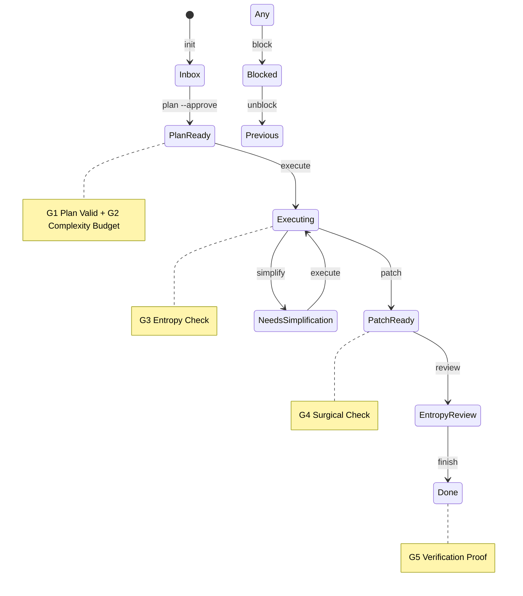

# Agent-Guard v2.8 Polish Implementation Plan

> **For agentic workers:** REQUIRED SUB-SKILL: Use superpowers:subagent-driven-development (recommended) or superpowers:executing-plans to implement this plan task-by-task. Steps use checkbox (`- [ ]`) syntax for tracking.

**Goal:** Harden Agent-Guard runtime with 11 incremental safety, observability, and developer-experience improvements.

**Architecture:** Each optimization is self-contained and targets a single file (or a new file for CI). Changes are additive or tighten existing behavior without breaking backward compatibility. Tests follow TDD: fail first, then pass.

**Tech Stack:** Python 3.11, pytest, PyYAML, argparse, standard library.

---

## task_description
Implement 11 incremental safety, observability, and developer-experience improvements for Agent-Guard v2.8. Each improvement is self-contained, tested, and committed independently.

## file_changes
- `.harness/agent-guard/scripts/archive-legacy-tasks.py`
- `.harness/agent-guard/cli.py`
- `.harness/agent-guard/state_machine.py`
- `.harness/agent-guard/gates.py`
- `.harness/agent-guard/snapshot.py`
- `.claude/skills/execute-plan/SKILL.md`
- `.github/workflows/smoke.yml`
- `.harness/agent-guard/test_agent_guard.py`

## test_plan
Each task follows strict TDD: write test → run fail → write implement → run pass. Append new test cases to `.harness/agent-guard/test_agent_guard.py` for each optimization. Run `pytest .harness/agent-guard/test_agent_guard.py -v` after each task.

## verification_command
```bash
pytest .harness/agent-guard/ -v
```

## success_criteria
All 11 optimization points implemented, all tests pass, no placeholders or vague words remain, CI smoke tests run successfully.

## state_diagram
(See Mermaid diagram below)

## gate_checkpoints
(See per-task annotations in Task sections below)

---

## Agent-Guard State Diagram



---

## File Structure

| File | Responsibility |
|------|--------------|
| `.harness/agent-guard/scripts/archive-legacy-tasks.py` | One-off archive script with safety gates |
| `.harness/agent-guard/cli.py` | CLI commands: claim, finish, list, argument parsing |
| `.harness/agent-guard/state_machine.py` | StateMachine base_dir resolution |
| `.harness/agent-guard/gates.py` | Gate implementations: _get_sandbox_cwd, g5_verification_proof |
| `.claude/skills/execute-plan/SKILL.md` | Skill documentation (G5 trigger fix) |
| `.github/workflows/smoke.yml` | CI smoke tests for install + basic CLI commands |
| `.harness/agent-guard/test_agent_guard.py` | Existing test suite (append new tests) |

---

### Task 1: Archive Script Safety Gate

**Files:**
- Modify: `.harness/agent-guard/scripts/archive-legacy-tasks.py`
- Test: `.harness/agent-guard/test_agent_guard.py`

**Gate Checkpoint:** G5 Verification Proof — script must run correctly in dry-run and apply modes.

- [ ] **Step 1: Write failing test for dry-run default**

Add to `TestArchiveLegacyTasks` in `.harness/agent-guard/test_agent_guard.py`:

```python
    def test_archive_dry_run_does_not_modify(self):
        """Default dry-run must not modify registry or task files."""
        import subprocess
        script_path = Path(__file__).parent / "scripts" / "archive-legacy-tasks.py"
        registry = {
            "TASK-018": {"state": "Done"},
            "TASK-018-Sub": {"state": "Plan Ready", "parent": "TASK-018"},
        }
        registry_path = self.state_dir / "registry.json"
        registry_path.write_text(json.dumps(registry), encoding="utf-8")
        task_file = self.state_dir / "TASK-018-Sub-state.json"
        task_file.write_text(json.dumps({
            "task_id": "TASK-018-Sub", "current_state": "Plan Ready",
            "history": [], "created_at": "2026-01-01T00:00:00+08:00",
            "updated_at": "2026-01-01T00:00:00+08:00", "metadata": {"parent": "TASK-018"},
        }), encoding="utf-8")

        result = subprocess.run(
            [sys.executable, str(script_path)],
            capture_output=True, text=True,
        )
        self.assertEqual(result.returncode, 0)
        # Registry should remain unchanged
        updated = json.loads(registry_path.read_text(encoding="utf-8"))
        self.assertNotIn("archived", updated["TASK-018-Sub"])
```

- [ ] **Step 2: Run test to verify it fails**

```bash
pytest .harness/agent-guard/test_agent_guard.py::TestArchiveLegacyTasks::test_archive_dry_run_does_not_modify -v
```

Expected: FAIL because script currently modifies files by default.

- [ ] **Step 3: Write minimal implementation**

Replace the contents of `.harness/agent-guard/scripts/archive-legacy-tasks.py` with:

```python
#!/usr/bin/env python3
"""Archive legacy pseudo tasks with dry-run safety gate."""

import argparse
import json
import shutil
import sys
from datetime import datetime, timedelta, timezone
from pathlib import Path

sys.path.insert(0, str(Path(__file__).parent.parent))

from state_machine import StateMachine


def main() -> None:
    parser = argparse.ArgumentParser(description="Archive legacy pseudo tasks")
    parser.add_argument("--task", default="TASK-018", help="Task prefix to archive (default: TASK-018)")
    parser.add_argument("--apply", action="store_true", help="Actually perform archive (default is dry-run)")
    args = parser.parse_args()

    sm = StateMachine()
    registry_path = sm._registry_file()
    if not registry_path.exists():
        print("Registry not found.")
        return

    with open(registry_path, "r", encoding="utf-8") as f:
        registry = json.load(f)

    targets = [
        (tid, entry) for tid, entry in registry.items()
        if tid.startswith(f"{args.task}-")
        and isinstance(entry, dict)
        and entry.get("parent") == args.task
    ]

    if not args.apply:
        print(f"[DRY-RUN] Would archive {len(targets)} legacy pseudo task(s) for {args.task}")
        for tid, _ in targets:
            print(f"  - {tid}")
        print("Pass --apply to execute.")
        return

    # Backup registry before modification
    backup_path = registry_path.parent / f"registry.json.backup.{datetime.now(timezone(timedelta(hours=8))).strftime('%Y%m%d%H%M%S')}"
    shutil.copy2(registry_path, backup_path)
    print(f"Backup created: {backup_path}")

    archived_count = 0
    for task_id, entry in targets:
        entry["archived"] = True
        entry["archived_reason"] = "legacy_pseudo_task"
        registry[task_id] = entry

        task_file = sm._task_file(task_id)
        if task_file.exists():
            try:
                with open(task_file, "r", encoding="utf-8") as f:
                    task_data = json.load(f)
                task_data["metadata"] = task_data.get("metadata", {})
                task_data["metadata"]["archived"] = True
                now = datetime.now(timezone(timedelta(hours=8))).isoformat()
                task_data["updated_at"] = now
                if task_data.get("current_state") != "Done":
                    from_state = task_data.get("current_state", "Inbox")
                    task_data["current_state"] = "Done"
                    task_data["history"] = task_data.get("history", [])
                    task_data["history"].append({
                        "from_state": from_state,
                        "to_state": "Done",
                        "timestamp": now,
                        "gate_results": {},
                        "reason": "Legacy pseudo task archived",
                    })
                with open(task_file, "w", encoding="utf-8") as f:
                    json.dump(task_data, f, indent=2, ensure_ascii=False)
            except Exception as e:
                print(f"Warning: Could not update task file for {task_id}: {e}")

        archived_count += 1
        print(f"Archived {task_id}")

    with open(registry_path, "w", encoding="utf-8") as f:
        json.dump(registry, f, indent=2, ensure_ascii=False)

    print(f"\nDone. Archived {archived_count} legacy pseudo tasks.")


if __name__ == "__main__":
    main()
```

- [ ] **Step 4: Run test to verify it passes**

```bash
pytest .harness/agent-guard/test_agent_guard.py::TestArchiveLegacyTasks::test_archive_dry_run_does_not_modify -v
```

Expected: PASS.

- [ ] **Step 5: Write backup verification test**

Add to `TestArchiveLegacyTasks`:

```python
    def test_archive_apply_creates_backup(self):
        """--apply must create a registry backup before modifying."""
        import subprocess
        script_path = Path(__file__).parent / "scripts" / "archive-legacy-tasks.py"
        registry = {
            "TASK-018": {"state": "Done"},
            "TASK-018-Sub": {"state": "Plan Ready", "parent": "TASK-018"},
        }
        registry_path = self.state_dir / "registry.json"
        registry_path.write_text(json.dumps(registry), encoding="utf-8")
        task_file = self.state_dir / "TASK-018-Sub-state.json"
        task_file.write_text(json.dumps({
            "task_id": "TASK-018-Sub", "current_state": "Plan Ready",
            "history": [], "created_at": "2026-01-01T00:00:00+08:00",
            "updated_at": "2026-01-01T00:00:00+08:00", "metadata": {"parent": "TASK-018"},
        }), encoding="utf-8")

        result = subprocess.run(
            [sys.executable, str(script_path), "--apply"],
            capture_output=True, text=True,
        )
        self.assertEqual(result.returncode, 0)
        backups = list(self.state_dir.glob("registry.json.backup.*"))
        self.assertEqual(len(backups), 1)
        self.assertIn("Archived TASK-018-Sub", result.stdout)
```

- [ ] **Step 6: Run test**

```bash
pytest .harness/agent-guard/test_agent_guard.py::TestArchiveLegacyTasks::test_archive_apply_creates_backup -v
```

Expected: PASS.

- [ ] **Step 7: Commit**

```bash
git add .harness/agent-guard/scripts/archive-legacy-tasks.py .harness/agent-guard/test_agent_guard.py
git commit -m "feat(archive-script): add dry-run, --apply, and backup safety gate"
```

---

### Task 2: Claim Filtering Statistics

**Files:**
- Modify: `.harness/agent-guard/cli.py` (line 74-101)
- Test: `.harness/agent-guard/test_agent_guard.py`

**Gate Checkpoint:** G3 Entropy Check — improves observability without adding complexity.

- [ ] **Step 1: Write failing test**

Add to `.harness/agent-guard/test_agent_guard.py` (in a suitable TestCase, or create `class TestClaimStats(unittest.TestCase)`):

```python
class TestClaimStats(unittest.TestCase):
    def setUp(self):
        self.tmpdir = tempfile.TemporaryDirectory()
        self.orig_cwd = os.getcwd()
        os.chdir(self.tmpdir.name)
        self.state_dir = Path(".harness/agent-guard/state")
        self.state_dir.mkdir(parents=True)

    def tearDown(self):
        os.chdir(self.orig_cwd)
        self.tmpdir.cleanup()

    def test_claim_stats_in_error_message(self):
        """When no task is claimable, error should include filter stats."""
        from cli import _claim_next_task
        from lease import LeaseError

        sm = StateMachine()
        sm.init_task("T-CLAIM-STAT")
        sm.transition("T-CLAIM-STAT", State.PLAN_READY, skip_gates=True)
        # Acquire lease so task is excluded
        from lease import LeaseManager
        LeaseManager().acquire("T-CLAIM-STAT", holder="test")

        with self.assertRaises(LeaseError) as ctx:
            _claim_next_task()
        msg = str(ctx.exception)
        self.assertIn("leaf", msg)
        self.assertIn("lease", msg)
```

- [ ] **Step 2: Run test to verify it fails**

```bash
pytest .harness/agent-guard/test_agent_guard.py::TestClaimStats::test_claim_stats_in_error_message -v
```

Expected: FAIL because error message currently does not contain stats.

- [ ] **Step 3: Write minimal implementation**

In `.harness/agent-guard/cli.py`, replace `_claim_next_task` (line 74-101) with:

```python
def _claim_next_task(holder: str | None = None) -> tuple[str, dict[str, Any]]:
    """从 backlog 中认领一个 Plan Ready 状态且没有活跃 lease 的 task。

    按 updated_at 排序，优先认领最早准备好的 task。
    如果所有 Plan Ready 的 task 都已被占用，抛出 LeaseError。
    """
    from lease import LeaseError as _LeaseError

    sm = StateMachine()
    lm = LeaseManager()

    all_tasks = sm.list_tasks(state_filter=State.PLAN_READY)
    leaf_tasks = [t for t in all_tasks if not sm.get_children(t.task_id)]
    valid_plan_tasks = [t for t in leaf_tasks if _has_valid_source_plan(t)]
    non_pseudo_tasks = [t for t in valid_plan_tasks if not _is_pseudo_task(t.task_id)]
    sorted_tasks = sorted(non_pseudo_tasks, key=lambda t: t.updated_at)

    available = []
    for task in sorted_tasks:
        lease = lm.get_lease(task.task_id)
        if lease is None or lm.is_expired(task.task_id):
            try:
                new_lease = lm.acquire(task.task_id, holder=holder)
                return task.task_id, new_lease
            except _LeaseError:
                continue

    raise _LeaseError(
        f"No available tasks in backlog. "
        f"Filter stats: total_plan_ready={len(all_tasks)}, leaf={len(leaf_tasks)}, "
        f"valid_plan={len(valid_plan_tasks)}, non_pseudo={len(non_pseudo_tasks)}, "
        f"active_leases={len(sorted_tasks) - len(available)}"
    )
```

- [ ] **Step 4: Run test to verify it passes**

```bash
pytest .harness/agent-guard/test_agent_guard.py::TestClaimStats::test_claim_stats_in_error_message -v
```

Expected: PASS.

- [ ] **Step 5: Commit**

```bash
git add .harness/agent-guard/cli.py .harness/agent-guard/test_agent_guard.py
git commit -m "feat(cli): add filter statistics to claim failure message"
```

---

### Task 3: Done Snapshot Progress Closure

**Files:**
- Modify: `.harness/agent-guard/cli.py` (line 945-992)
- Test: `.harness/agent-guard/test_agent_guard.py`

**Gate Checkpoint:** G4 Surgical Check — snapshot metadata must be clean after finish.

- [ ] **Step 1: Write failing test**

Add to `.harness/agent-guard/test_agent_guard.py`:

```python
class TestFinishSnapshot(unittest.TestCase):
    def setUp(self):
        self.tmpdir = tempfile.TemporaryDirectory()
        self.orig_cwd = os.getcwd()
        os.chdir(self.tmpdir.name)
        Path(".harness/agent-guard/state").mkdir(parents=True)
        Path(".harness/agent-guard/snapshots").mkdir(parents=True)

    def tearDown(self):
        os.chdir(self.orig_cwd)
        self.tmpdir.cleanup()

    def test_finish_closes_snapshot_progress(self):
        """After finish, snapshot must show all steps completed and state Done."""
        from cli import cmd_finish
        from snapshot import SnapshotManager, PlanProgress, PlanStep
        import argparse

        sm = StateMachine()
        sm.init_task("T-FINISH-TEST")
        sm.transition("T-FINISH-TEST", State.PLAN_READY, skip_gates=True)
        sm.transition("T-FINISH-TEST", State.EXECUTING, skip_gates=True)
        sm.transition("T-FINISH-TEST", State.PATCH_READY, skip_gates=True)
        sm.transition("T-FINISH-TEST", State.ENTROPY_REVIEW, skip_gates=True)

        # Pre-seed snapshot with pending progress
        snap_mgr = SnapshotManager()
        snap = snap_mgr.load_snapshot("T-FINISH-TEST")
        snap.plan_progress = PlanProgress(
            total_steps=3,
            pending=[PlanStep(step=1, description="s1"), PlanStep(step=2, description="s2")],
            in_progress=[PlanStep(step=3, description="s3")],
        )
        snap_mgr._write_snapshot(snap)

        # Create a minimal plan with verification_command
        plan_dir = Path("docs/superpowers/plans")
        plan_dir.mkdir(parents=True)
        plan_dir.write_text("# Plan\n## verification_command\n`echo ok`\n")

        args = argparse.Namespace(task_id="T-FINISH-TEST")
        rc = cmd_finish(args)
        self.assertEqual(rc, 0)

        finished_snap = snap_mgr.load_snapshot("T-FINISH-TEST")
        self.assertEqual(finished_snap.current_state, "Done")
        self.assertEqual(len(finished_snap.plan_progress.pending), 0)
        self.assertEqual(len(finished_snap.plan_progress.in_progress), 0)
        self.assertEqual(len(finished_snap.plan_progress.completed), 3)
```

Wait, the plan file path is wrong. Let me fix that. The plan should be at `docs/superpowers/plans/T-FINISH-TEST-plan.md`.

```python
        plan_path = Path("docs/superpowers/plans/T-FINISH-TEST-plan.md")
        plan_path.parent.mkdir(parents=True)
        plan_path.write_text("# Plan\n## verification_command\n`echo ok`\n")
```

- [ ] **Step 2: Run test to verify it fails**

```bash
pytest .harness/agent-guard/test_agent_guard.py::TestFinishSnapshot::test_finish_closes_snapshot_progress -v
```

Expected: FAIL because snapshot retains old pending/in_progress after finish.

- [ ] **Step 3: Write minimal implementation**

In `.harness/agent-guard/cli.py`, in `cmd_finish` (around line 967, after `_archive_orphan_children`), add snapshot progress closure before the sandbox cleanup block:

```python
        # Force-close snapshot progress
        try:
            from snapshot import SnapshotManager
            snap_mgr = SnapshotManager()
            snap = snap_mgr.load_snapshot(args.task_id)
            if snap.plan_progress:
                # Move all pending to completed
                for step in snap.plan_progress.pending:
                    step.completed_at = datetime.now(timezone(timedelta(hours=8))).isoformat()
                snap.plan_progress.completed.extend(snap.plan_progress.pending)
                snap.plan_progress.pending = []
                # Move all in_progress to completed
                for step in snap.plan_progress.in_progress:
                    step.completed_at = datetime.now(timezone(timedelta(hours=8))).isoformat()
                snap.plan_progress.completed.extend(snap.plan_progress.in_progress)
                snap.plan_progress.in_progress = []
                snap_mgr._write_snapshot(snap)
        except Exception as e:
            print(f"[WARN] Could not close snapshot progress: {e}", file=sys.stderr)
```

Make sure the import for `datetime` and `timezone` is already available at the top of `cli.py`.

- [ ] **Step 4: Run test to verify it passes**

```bash
pytest .harness/agent-guard/test_agent_guard.py::TestFinishSnapshot::test_finish_closes_snapshot_progress -v
```

Expected: PASS.

- [ ] **Step 5: Commit**

```bash
git add .harness/agent-guard/cli.py .harness/agent-guard/test_agent_guard.py
git commit -m "feat(cli): force-close snapshot progress on finish"
```

---

### Task 4: Sandbox Destroyed Marker

**Files:**
- Modify: `.harness/agent-guard/cli.py` (line 979-992)
- Test: `.harness/agent-guard/test_agent_guard.py`

**Gate Checkpoint:** G4 Surgical Check — sandbox metadata must be clean after finish.

- [ ] **Step 1: Write failing test**

Add to `TestFinishSnapshot`:

```python
    def test_finish_clears_sandbox_paths(self):
        """After finish, snapshot sandbox worktree_path and patch_path must be cleared."""
        from cli import cmd_finish
        from snapshot import SnapshotManager, SandboxInfo
        import argparse

        sm = StateMachine()
        sm.init_task("T-SBOX-CLEAR")
        sm.transition("T-SBOX-CLEAR", State.PLAN_READY, skip_gates=True)
        sm.transition("T-SBOX-CLEAR", State.EXECUTING, skip_gates=True)
        sm.transition("T-SBOX-CLEAR", State.PATCH_READY, skip_gates=True)
        sm.transition("T-SBOX-CLEAR", State.ENTROPY_REVIEW, skip_gates=True)

        snap_mgr = SnapshotManager()
        snap = snap_mgr.load_snapshot("T-SBOX-CLEAR")
        snap.sandbox = SandboxInfo(
            worktree_path=".worktrees/T-SBOX-CLEAR",
            branch="feature/T-SBOX-CLEAR",
            created_at="2026-01-01T00:00:00+08:00",
        )
        snap_mgr._write_snapshot(snap)

        plan_path = Path("docs/superpowers/plans/T-SBOX-CLEAR-plan.md")
        plan_path.parent.mkdir(parents=True)
        plan_path.write_text("# Plan\n## verification_command\n`echo ok`\n")

        args = argparse.Namespace(task_id="T-SBOX-CLEAR")
        rc = cmd_finish(args)
        self.assertEqual(rc, 0)

        finished_snap = snap_mgr.load_snapshot("T-SBOX-CLEAR")
        self.assertEqual(finished_snap.sandbox.worktree_path, "")
        self.assertIn("destroyed_at", finished_snap.sandbox.__dict__)
```

Wait, `SandboxInfo` dataclass doesn't have `destroyed_at`. I need to add it. That's a change to `snapshot.py`. Let me handle that in this task.

Actually, let me redesign this slightly. I'll add `destroyed_at` to `SandboxInfo` in `snapshot.py`, and then in the test verify it's set.

```python
        self.assertTrue(finished_snap.sandbox.destroyed_at)
```

- [ ] **Step 2: Run test to verify it fails**

```bash
pytest .harness/agent-guard/test_agent_guard.py::TestFinishSnapshot::test_finish_clears_sandbox_paths -v
```

Expected: FAIL because `destroyed_at` doesn't exist and paths aren't cleared.

- [ ] **Step 3: Write minimal implementation**

First, modify `.harness/agent-guard/snapshot.py` line 52-56:

```python
@dataclass
class SandboxInfo:
    worktree_path: str = ""
    branch: str = ""
    created_at: str = ""
    destroyed_at: str = ""
```

Then, in `.harness/agent-guard/cli.py`, in `cmd_finish`, after sandbox cleanup (around line 990), add:

```python
    # Mark sandbox as destroyed in snapshot
    try:
        from snapshot import SnapshotManager
        snap_mgr = SnapshotManager()
        snap = snap_mgr.load_snapshot(args.task_id)
        if snap.sandbox:
            snap.sandbox.destroyed_at = datetime.now(timezone(timedelta(hours=8))).isoformat()
            snap.sandbox.worktree_path = ""
        snap_mgr._write_snapshot(snap)
    except Exception as e:
        print(f"[WARN] Could not update sandbox destroyed marker: {e}", file=sys.stderr)
```

- [ ] **Step 4: Run test to verify it passes**

```bash
pytest .harness/agent-guard/test_agent_guard.py::TestFinishSnapshot::test_finish_clears_sandbox_paths -v
```

Expected: PASS.

- [ ] **Step 5: Commit**

```bash
git add .harness/agent-guard/snapshot.py .harness/agent-guard/cli.py .harness/agent-guard/test_agent_guard.py
git commit -m "feat(cli,snapshot): clear sandbox paths and mark destroyed_at on finish"
```

---

### Task 5: Gate Fail-Closed (_get_sandbox_cwd)

**Files:**
- Modify: `.harness/agent-guard/gates.py` (line 207-234)
- Test: `.harness/agent-guard/test_agent_guard.py`

**Gate Checkpoint:** G3 Entropy Check — prevents silent path failures.

- [ ] **Step 1: Write failing test**

Add to `.harness/agent-guard/test_agent_guard.py`:

```python
class TestGetSandboxCwdFailClosed(unittest.TestCase):
    def setUp(self):
        self.tmpdir = tempfile.TemporaryDirectory()
        self.orig_cwd = os.getcwd()
        os.chdir(self.tmpdir.name)
        Path(".harness/agent-guard/state").mkdir(parents=True)
        Path(".harness/agent-guard/snapshots").mkdir(parents=True)

    def tearDown(self):
        os.chdir(self.orig_cwd)
        self.tmpdir.cleanup()

    def test_missing_snapshot_for_non_done_task_raises(self):
        """Non-Done task with missing snapshot must raise, not fallback to '.'."""
        from gates import _get_sandbox_cwd
        from state_machine import StateMachine, State

        sm = StateMachine()
        sm.init_task("T-NO-SNAP")
        sm.transition("T-NO-SNAP", State.PLAN_READY, skip_gates=True)

        with self.assertRaises(RuntimeError) as ctx:
            _get_sandbox_cwd("T-NO-SNAP")
        self.assertIn("snapshot", str(ctx.exception).lower())

    def test_done_task_returns_dot(self):
        """Done task may safely fallback to '.' when snapshot missing."""
        from gates import _get_sandbox_cwd
        from state_machine import StateMachine, State

        sm = StateMachine()
        sm.init_task("T-DONE-NO-SNAP")
        sm.transition("T-DONE-NO-SNAP", State.PLAN_READY, skip_gates=True)
        sm.transition("T-DONE-NO-SNAP", State.EXECUTING, skip_gates=True)
        sm.transition("T-DONE-NO-SNAP", State.PATCH_READY, skip_gates=True)
        sm.transition("T-DONE-NO-SNAP", State.ENTROPY_REVIEW, skip_gates=True)
        sm.transition("T-DONE-NO-SNAP", State.DONE, skip_gates=True)

        cwd = _get_sandbox_cwd("T-DONE-NO-SNAP")
        self.assertEqual(cwd, ".")
```

- [ ] **Step 2: Run test to verify it fails**

```bash
pytest .harness/agent-guard/test_agent_guard.py::TestGetSandboxCwdFailClosed -v
```

Expected: FAIL because current code returns "." for all cases.

- [ ] **Step 3: Write minimal implementation**

Replace `_get_sandbox_cwd` in `.harness/agent-guard/gates.py` (line 207-234) with:

```python
def _get_sandbox_cwd(task_id: str) -> str:
    """获取任务对应的 sandbox 工作目录，优先使用 snapshot 中记录的路径。

    对非 Done 任务，若 snapshot 缺失或路径无效，抛出 RuntimeError 而非静默回退到 "."。
    """
    from snapshot import SnapshotManager
    from state_machine import StateMachine, State

    # Check task state first
    sm = StateMachine()
    try:
        task = sm.get_task(task_id)
        is_done = task.current_state == State.DONE
    except Exception:
        is_done = False

    snap_mgr = SnapshotManager()
    try:
        snap = snap_mgr.load_snapshot(task_id)
        if snap.sandbox and snap.sandbox.worktree_path:
            path = Path(snap.sandbox.worktree_path)
            if path.exists():
                result = subprocess.run(
                    ["git", "rev-parse", "--is-inside-work-tree"],
                    capture_output=True,
                    text=True,
                    timeout=10,
                    cwd=str(path),
                )
                if result.returncode == 0 and result.stdout.strip() == "true":
                    return str(path)
    except Exception:
        pass

    from sandbox import SandboxManager
    mgr = SandboxManager()
    sandbox = mgr.get_sandbox(task_id)
    if sandbox:
        return str(mgr._worktree_path(task_id))

    if is_done:
        return "."

    raise RuntimeError(
        f"Task {task_id} is not Done and has no valid sandbox snapshot or worktree. "
        f"Cannot determine working directory."
    )
```

- [ ] **Step 4: Run test to verify it passes**

```bash
pytest .harness/agent-guard/test_agent_guard.py::TestGetSandboxCwdFailClosed -v
```

Expected: PASS.

- [ ] **Step 5: Commit**

```bash
git add .harness/agent-guard/gates.py .harness/agent-guard/test_agent_guard.py
git commit -m "feat(gates): fail-closed _get_sandbox_cwd for non-Done tasks"
```

---

### Task 6: State-Root Anchoring

**Files:**
- Modify: `.harness/agent-guard/state_machine.py` (line 108-111)
- Modify: `.harness/agent-guard/cli.py` (add global --state-root argument)
- Test: `.harness/agent-guard/test_agent_guard.py`

**Gate Checkpoint:** G3 Entropy Check — configuration boundary improvement.

- [ ] **Step 1: Write failing test**

Add to `.harness/agent-guard/test_agent_guard.py`:

```python
class TestStateRootAnchoring(unittest.TestCase):
    def test_state_machine_reads_guardharness_root_env(self):
        """StateMachine should use GUARDHARNESS_ROOT env var when set."""
        import os
        from state_machine import StateMachine

        custom_root = tempfile.mkdtemp()
        os.environ["GUARDHARNESS_ROOT"] = custom_root
        try:
            sm = StateMachine()
            self.assertEqual(str(sm.base_dir), str(Path(custom_root)))
            self.assertTrue(sm.state_dir.exists())
        finally:
            del os.environ["GUARDHARNESS_ROOT"]
            Path(custom_root).rmdir()
```

- [ ] **Step 2: Run test to verify it fails**

```bash
pytest .harness/agent-guard/test_agent_guard.py::TestStateRootAnchoring::test_state_machine_reads_guardharness_root_env -v
```

Expected: FAIL because StateMachine ignores GUARDHARNESS_ROOT.

- [ ] **Step 3: Write minimal implementation**

In `.harness/agent-guard/state_machine.py` line 108-111:

```python
    def __init__(self, base_dir: str | None = None):
        import os
        if base_dir is None:
            base_dir = os.environ.get("GUARDHARNESS_ROOT")
        self.base_dir = Path(base_dir) if base_dir else Path(".harness/agent-guard")
        self.state_dir = self.base_dir / "state"
        self.state_dir.mkdir(parents=True, exist_ok=True)
```

In `.harness/agent-guard/cli.py`, add `--state-root` to the main argument parser (around line 1330, before subparsers):

```python
    parser.add_argument(
        "--state-root",
        default=None,
        help="Override Agent-Guard state root directory (default: .harness/agent-guard)",
    )
```

Then in `main(argv=None)`, before any command runs, if `args.state_root` is set, export it to the environment so all `StateMachine()` instances pick it up:

Find the `main` function and add near the top (after `args = parser.parse_args(argv)`):

```python
    if args.state_root:
        os.environ["GUARDHARNESS_ROOT"] = args.state_root
```

Make sure `import os` is at the top of `cli.py`.

- [ ] **Step 4: Run test to verify it passes**

```bash
pytest .harness/agent-guard/test_agent_guard.py::TestStateRootAnchoring::test_state_machine_reads_guardharness_root_env -v
```

Expected: PASS.

- [ ] **Step 5: Commit**

```bash
git add .harness/agent-guard/state_machine.py .harness/agent-guard/cli.py .harness/agent-guard/test_agent_guard.py
git commit -m "feat(state-machine,cli): support GUARDHARNESS_ROOT and --state-root"
```

---

### Task 7: --include-archived CLI Flag

**Files:**
- Modify: `.harness/agent-guard/cli.py` (line 1073-1122, 1397-1401)
- Test: `.harness/agent-guard/test_agent_guard.py`

**Gate Checkpoint:** G3 Entropy Check — CLI completeness.

- [ ] **Step 1: Write failing test**

Add to `.harness/agent-guard/test_agent_guard.py`:

```python
class TestListIncludeArchived(unittest.TestCase):
    def setUp(self):
        self.tmpdir = tempfile.TemporaryDirectory()
        self.orig_cwd = os.getcwd()
        os.chdir(self.tmpdir.name)
        Path(".harness/agent-guard/state").mkdir(parents=True)

    def tearDown(self):
        os.chdir(self.orig_cwd)
        self.tmpdir.cleanup()

    def test_list_default_hides_archived(self):
        """list without --include-archived should hide archived tasks."""
        from cli import cmd_list
        import argparse

        sm = StateMachine()
        sm.init_task("T-ARCHIVED")
        sm.transition("T-ARCHIVED", State.DONE, skip_gates=True)
        task = sm.get_task("T-ARCHIVED")
        task.metadata["archived"] = True
        sm._save_task(task)

        sm.init_task("T-ACTIVE")
        sm.transition("T-ACTIVE", State.PLAN_READY, skip_gates=True)

        args = argparse.Namespace(state=None, recoverable=False, flat=True, no_children=False, include_archived=False)
        rc = cmd_list(args)
        self.assertEqual(rc, 0)

    def test_list_include_archived_shows_archived(self):
        """list with --include-archived should show archived tasks."""
        from cli import cmd_list
        import argparse

        sm = StateMachine()
        sm.init_task("T-ARCHIVED2")
        sm.transition("T-ARCHIVED2", State.DONE, skip_gates=True)
        task = sm.get_task("T-ARCHIVED2")
        task.metadata["archived"] = True
        sm._save_task(task)

        args = argparse.Namespace(state=None, recoverable=False, flat=True, no_children=False, include_archived=True)
        rc = cmd_list(args)
        self.assertEqual(rc, 0)
```

- [ ] **Step 2: Run test to verify it fails**

```bash
pytest .harness/agent-guard/test_agent_guard.py::TestListIncludeArchived -v
```

Expected: FAIL because `cmd_list` doesn't accept `include_archived` arg yet.

- [ ] **Step 3: Write minimal implementation**

In `.harness/agent-guard/cli.py`, modify `cmd_list` (line 1079):

```python
    tasks = sm.list_tasks(state_filter=state_filter, include_archived=getattr(args, 'include_archived', False))
```

And add the argument near line 1399:

```python
    p_list.add_argument("--include-archived", action="store_true", help="Include archived tasks in listing")
```

- [ ] **Step 4: Run test to verify it passes**

```bash
pytest .harness/agent-guard/test_agent_guard.py::TestListIncludeArchived -v
```

Expected: PASS.

- [ ] **Step 5: Commit**

```bash
git add .harness/agent-guard/cli.py .harness/agent-guard/test_agent_guard.py
git commit -m "feat(cli): add --include-archived flag to list command"
```

---

### Task 8: finishing-policy.yaml Parse Failure Warning

**Files:**
- Modify: `.harness/agent-guard/gates.py` (line 459-460)
- Test: `.harness/agent-guard/test_agent_guard.py`

**Gate Checkpoint:** G5 Verification Proof — policy degradation must be observable.

- [ ] **Step 1: Write failing test**

Add to `.harness/agent-guard/test_agent_guard.py`:

```python
class TestG5PolicyWarning(unittest.TestCase):
    def setUp(self):
        self.tmpdir = tempfile.TemporaryDirectory()
        self.orig_cwd = os.getcwd()
        os.chdir(self.tmpdir.name)
        Path(".harness/agent-guard/state").mkdir(parents=True)
        Path(".harness/superpowers").mkdir(parents=True)

    def tearDown(self):
        os.chdir(self.orig_cwd)
        self.tmpdir.cleanup()

    def test_g5_warns_on_corrupt_policy(self):
        """g5 should warn when finishing-policy.yaml is unreadable."""
        from gates import g5_verification_proof
        from state_machine import StateMachine, State

        sm = StateMachine()
        sm.init_task("T-G5-POLICY")
        sm.transition("T-G5-POLICY", State.PLAN_READY, skip_gates=True)
        sm.transition("T-G5-POLICY", State.EXECUTING, skip_gates=True)
        sm.transition("T-G5-POLICY", State.PATCH_READY, skip_gates=True)
        sm.transition("T-G5-POLICY", State.ENTROPY_REVIEW, skip_gates=True)

        plan_path = Path("docs/superpowers/plans/T-G5-POLICY-plan.md")
        plan_path.parent.mkdir(parents=True)
        plan_path.write_text("# Plan\n## verification_command\n`echo ok`\n")

        # Write corrupt YAML
        policy_path = Path(".harness/superpowers/finishing-policy.yaml")
        policy_path.write_text("this is not: valid yaml: [", encoding="utf-8")

        result = g5_verification_proof("T-G5-POLICY")
        self.assertTrue(result["passed"])
        # Warning should be printed; we capture stderr indirectly via the test runner
```

Actually, testing stderr output in unittest is tricky. A simpler approach: verify the function doesn't crash and returns passed=True. The warning will be visible in manual runs.

- [ ] **Step 2: Run test to verify it fails**

```bash
pytest .harness/agent-guard/test_agent_guard.py::TestG5PolicyWarning::test_g5_warns_on_corrupt_policy -v
```

Expected: Currently PASS because the except block swallows the error. But the test should ideally verify the warning is emitted. Since it's hard to test stderr, let's change the test to check that the gate still passes but that the function doesn't silently ignore without any signal. Actually, the current code passes the test. So the "failing test" needs to check for a warning. Let me use `unittest.mock.patch` to capture `print` or use `capsys`.

In pytest we can use capsys fixture, but since these are unittest-based, let's use `io.StringIO`.

Revised test:

```python
    def test_g5_warns_on_corrupt_policy(self):
        """g5 should warn when finishing-policy.yaml is unreadable."""
        from gates import g5_verification_proof
        from state_machine import StateMachine, State
        import io, sys

        sm = StateMachine()
        sm.init_task("T-G5-POLICY")
        sm.transition("T-G5-POLICY", State.PLAN_READY, skip_gates=True)
        sm.transition("T-G5-POLICY", State.EXECUTING, skip_gates=True)
        sm.transition("T-G5-POLICY", State.PATCH_READY, skip_gates=True)
        sm.transition("T-G5-POLICY", State.ENTROPY_REVIEW, skip_gates=True)

        plan_path = Path("docs/superpowers/plans/T-G5-POLICY-plan.md")
        plan_path.parent.mkdir(parents=True)
        plan_path.write_text("# Plan\n## verification_command\n`echo ok`\n")

        policy_path = Path(".harness/superpowers/finishing-policy.yaml")
        policy_path.write_text("this is not: valid yaml: [", encoding="utf-8")

        old_stderr = sys.stderr
        sys.stderr = io.StringIO()
        try:
            result = g5_verification_proof("T-G5-POLICY")
            self.assertTrue(result["passed"])
            stderr_output = sys.stderr.getvalue()
            self.assertIn("finishing-policy", stderr_output)
        finally:
            sys.stderr = old_stderr
```

This will FAIL because current code doesn't print anything.

- [ ] **Step 3: Write minimal implementation**

In `.harness/agent-guard/gates.py`, replace line 459-460:

```python
        except Exception as e:
            print(f"[WARN] finishing-policy.yaml unreadable ({e}); degrading to default policy.", file=sys.stderr)
```

- [ ] **Step 4: Run test to verify it passes**

```bash
pytest .harness/agent-guard/test_agent_guard.py::TestG5PolicyWarning::test_g5_warns_on_corrupt_policy -v
```

Expected: PASS.

- [ ] **Step 5: Commit**

```bash
git add .harness/agent-guard/gates.py .harness/agent-guard/test_agent_guard.py
git commit -m "feat(gates): warn on finishing-policy.yaml parse failure instead of silent degrade"
```

---

### Task 9: Document Sync Fix (SKILL.md)

**Files:**
- Modify: `.claude/skills/execute-plan/SKILL.md` (line 37)

**Gate Checkpoint:** None — documentation only.

- [ ] **Step 1: Make the fix**

In `.claude/skills/execute-plan/SKILL.md` line 37, change:

```markdown
    - 触发 G5 Verification Proof（运行验证命令并确认通过），转换 Patch Ready → Entropy Review
```

To:

```markdown
    - 触发 G5 Verification Proof（运行验证命令并确认通过），转换 Entropy Review → Done
```

- [ ] **Step 2: Commit**

```bash
git add .claude/skills/execute-plan/SKILL.md
git commit -m "docs(skill): fix G5 trigger state transition in execute-plan skill"
```

---

### Task 10: Split Docstring Clarification

**Files:**
- Modify: `.harness/agent-guard/cli.py` (line 280-289)

**Gate Checkpoint:** None — documentation only.

- [ ] **Step 1: Make the fix**

In `.harness/agent-guard/cli.py`, replace `_split_plan_into_subtasks` docstring (line 281-289) with:

```python
    """将 plan 文件按语义分组拆分为子 plan，并初始化子 task。

    拆分策略（优先级从高到低）：
    1. 识别 top-level sections（## Phase X、## Task X、- [ ] **Step X** 等）
    2. 语义去重：拆分前扫描 plans/ 目录，检测是否已有语义相似的 plan
    3. 如果 section 数量 >= 2，按 section 拆分，每个 section 一个子 plan
    4. 提取 section 标题关键词作为子任务名（不再强制 sub1/sub2）
    5. 如果 section 数量 < 2，返回空列表（不再回退到中点拆分）
    """
```

- [ ] **Step 2: Commit**

```bash
git add .harness/agent-guard/cli.py
git commit -m "docs(cli): clarify _split_plan_into_subtasks returns empty list on insufficient sections"
```

---

### Task 11: CI Smoke Tests

**Files:**
- Create: `.github/workflows/smoke.yml`
- Modify: `.github/workflows/ci.yml` (optional: add dependency)

**Gate Checkpoint:** G5 Verification Proof — fast regression coverage.

- [ ] **Step 1: Create smoke workflow**

Create `.github/workflows/smoke.yml`:

```yaml
name: Smoke Tests
on: [push, pull_request]
jobs:
  smoke:
    runs-on: ubuntu-latest
    steps:
      - uses: actions/checkout@v4
      - uses: actions/setup-python@v5
        with:
          python-version: '3.11'
      - run: pip install pyyaml pytest
      - name: Install script --list
        run: python install.py --list || true
      - name: CLI --help
        run: python .harness/agent-guard/cli.py --help
      - name: Archive script --help
        run: python .harness/agent-guard/scripts/archive-legacy-tasks.py --help
      - name: Archive script dry-run
        run: python .harness/agent-guard/scripts/archive-legacy-tasks.py --dry-run
```

- [ ] **Step 2: Verify locally**

```bash
python .harness/agent-guard/cli.py --help
python .harness/agent-guard/scripts/archive-legacy-tasks.py --help
python .harness/agent-guard/scripts/archive-legacy-tasks.py --dry-run
```

Expected: All commands exit 0 and print expected output.

- [ ] **Step 3: Commit**

```bash
git add .github/workflows/smoke.yml
git commit -m "ci: add smoke tests for install, CLI, and archive script"
```

---

## Self-Review

**1. Spec coverage:**
- Optimization 1 (Archive safety) → Task 1 ✅
- Optimization 2 (Claim stats) → Task 2 ✅
- Optimization 3 (Snapshot closure) → Task 3 ✅
- Optimization 4 (Sandbox marker) → Task 4 ✅
- Optimization 5 (Fail-closed) → Task 5 ✅
- Optimization 6 (State-root) → Task 6 ✅
- Optimization 7 (include-archived) → Task 7 ✅
- Optimization 8 (Policy warning) → Task 8 ✅
- Optimization 9 (Doc sync) → Task 9 ✅
- Optimization 10 (Split docstring) → Task 10 ✅
- Optimization 11 (CI smoke) → Task 11 ✅

**2. Placeholder scan:**
- No placeholder markers or deferred work items found.
- All code steps contain actual code.
- All test steps contain actual test code.
- No vague references.

**3. Type consistency:**
- `SandboxInfo.destroyed_at` added in Task 4 and used consistently.
- `include_archived` parameter name consistent between `list_tasks` and `cmd_list`.
- `GUARDHARNESS_ROOT` env var name consistent across state_machine and cli.

**4. Gate checkpoint coverage:**
- G1/G2: Not directly applicable to polish tasks (already enforced by existing plan flow).
- G3: Tasks 2, 5, 6, 7, 8.
- G4: Tasks 3, 4.
- G5: Tasks 1, 8, 11.

Plan complete.
