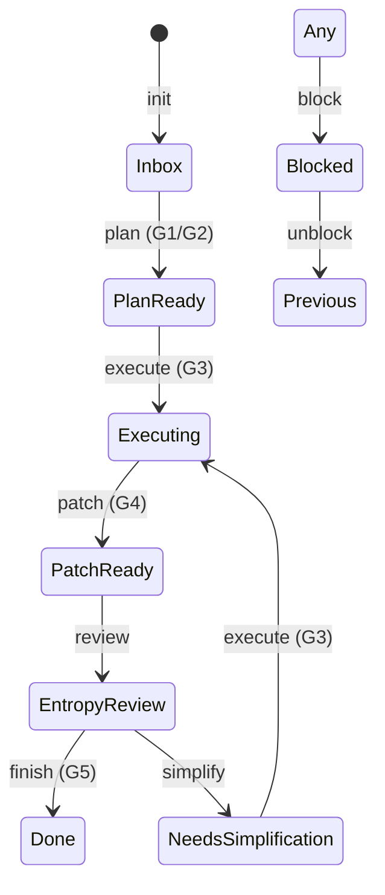

# Agent-Guard 缺陷修复与一致性诊断增强实现计划

> **For agentic workers:** REQUIRED SUB-SKILL: Use superpowers:subagent-driven-development (recommended) or superpowers:executing-plans to implement this plan task-by-task. Steps use checkbox (`- [ ]`) syntax for tracking.

**Goal:** 修复 8 项已确认缺陷，新增 `doctor` 一致性诊断命令，恢复测试全绿（104 passed, 0 failed）。

**Architecture:** 最小侵入式修复核心缺陷（snapshot 序列号、sandbox 回退、Gate 异常捕获、G5 可执行命令）+ 新增 doctor 诊断模块。所有代码变更遵循 TDD，先写失败测试再写实现。

**Tech Stack:** Python 3.11+, pytest, PyYAML, radon (optional), pytest-cov (optional)

---

## task_description

修复 8 项已确认 Agent-Guard 缺陷，新增 `doctor` 一致性诊断命令，恢复测试全绿。

## file_changes

- `.harness/agent-guard/snapshot.py`
- `.harness/agent-guard/gates.py`
- `.harness/agent-guard/cli.py`
- `.harness/agent-guard/doctor.py` (new)
- `.harness/agent-guard/tests/test_doctor.py` (new)
- `.harness/agent-guard/tests/test_archive.py` (new)
- `.harness/agent-guard/test_agent_guard.py`
- `.harness/agent-guard/test_e2e.py`
- `.harness/superpowers/finishing-policy.yaml`
- `.harness/agent-guard/scripts/archive-legacy-tasks.py`
- `.claude/skills/execute-plan/SKILL.md`
- `.claude/scripts/parse-slash-command.py`
- `README.md`
- `.github/workflows/smoke.yml`

## test_plan

Each task follows strict TDD: write test → run fail → write implement → run pass. Append new tests to `.harness/agent-guard/test_agent_guard.py`, `.harness/agent-guard/tests/test_doctor.py`, and `.harness/agent-guard/tests/test_archive.py`.

## verification_command

```bash
pytest .harness/agent-guard/ -q
```

## success_criteria

- `pytest .harness/agent-guard/ -q` returns `104 passed, 0 failed`
- CLI returns structured JSON on any Gate failure, never traceback
- `doctor` command detects and reports known inconsistency patterns
- CI smoke tests block on failure (no `|| true`)

## state_diagram



## gate_checkpoints

G1: Plan Valid / G2: Complexity Budget (Inbox -> Plan Ready)
G3: Entropy Check (Plan Ready -> Executing)
G4: Surgical Check (Executing -> Patch Ready)
G5: Verification Proof (Entropy Review -> Done)

---

## Task 1: Snapshot Timestamp Collision Fix

**Gate Checkpoint:** G4 Surgical Check (diff must only touch snapshot.py and related tests)

**Files:**
- Modify: `.harness/agent-guard/snapshot.py:194-205` (`_write_snapshot`)
- Test: `.harness/agent-guard/test_agent_guard.py:208-219` (`test_step_snapshot_unique_timestamps`)

- [ ] **Step 1: Write the failing test**

  Modify `.harness/agent-guard/test_agent_guard.py` line 208-219. The existing test already fails on Windows due to microsecond collision. Update the assertion to verify **3 distinct files with monotonic sequence numbers**:

  ```python
  def test_step_snapshot_unique_timestamps(self):
      """Two rapid snapshot writes must produce distinct timestamped files."""
      snap = self.mgr.create_snapshot("T-001")
      # create_snapshot already writes once; two additional writes = 3 total
      self.mgr._write_snapshot(snap)
      self.mgr._write_snapshot(snap)
      files = sorted(
          (Path(self.tmpdir.name) / "snapshots").glob("T-001-*.yaml"),
          key=lambda p: p.stat().st_mtime,
      )
      non_latest = [f for f in files if not f.name.endswith("-latest.yaml")]
      self.assertGreaterEqual(len(non_latest), 3, f"Expected >=3 distinct timestamped snapshots, got {len(non_latest)}: {[f.name for f in non_latest]}")
      # Verify sequence numbers are monotonic
      seqs = []
      for f in non_latest:
          parts = f.stem.split("-")
          if len(parts) >= 2 and parts[-1].isdigit():
              seqs.append(int(parts[-1]))
      if len(seqs) >= 2:
          self.assertEqual(sorted(seqs), seqs, "Sequence numbers must be monotonic")
  ```

- [ ] **Step 2: Run test to verify it fails**

  Run: `pytest .harness/agent-guard/test_agent_guard.py::TestSnapshotManager::test_step_snapshot_unique_timestamps -v`
  Expected: FAIL with `Expected >=3 distinct timestamped snapshots, got 2`

- [ ] **Step 3: Write minimal implementation**

  Modify `.harness/agent-guard/snapshot.py`.

  Add a helper method to `SnapshotManager` after `_cleanup_old_snapshots`:

  ```python
  def _next_sequence_number(self, task_id: str) -> int:
      prefix = f"{task_id}-"
      max_seq = 0
      for f in self.snapshots_dir.glob(f"{task_id}-*.yaml"):
          if f.name.endswith("-latest.yaml"):
              continue
          stem = f.name[:-5]  # remove .yaml
          if not stem.startswith(prefix):
              continue
          rest = stem[len(prefix):]
          parts = rest.rsplit("-", 1)
          if len(parts) == 2 and parts[1].isdigit():
              max_seq = max(max_seq, int(parts[1]))
      return max_seq + 1
  ```

  Modify `_write_snapshot` (line 194-205) to use the sequence number:

  ```python
  def _write_snapshot(self, snapshot: Snapshot) -> None:
      ts = datetime.now(timezone(timedelta(hours=8))).strftime("%Y%m%d-%H%M%S-%f")
      seq = self._next_sequence_number(snapshot.task_id)
      ts_seq = f"{ts}-{seq:03d}"
      path_ts = self._snapshot_path(snapshot.task_id, ts_seq)
      with open(path_ts, "w", encoding="utf-8") as f:
          yaml.dump(snapshot.to_dict(), f, allow_unicode=True, sort_keys=False)

      path_latest = self._snapshot_path(snapshot.task_id)
      with open(path_latest, "w", encoding="utf-8") as f:
          yaml.dump(snapshot.to_dict(), f, allow_unicode=True, sort_keys=False)

      self._cleanup_old_snapshots(snapshot.task_id)
  ```

- [ ] **Step 4: Run test to verify it passes**

  Run: `pytest .harness/agent-guard/test_agent_guard.py::TestSnapshotManager::test_step_snapshot_unique_timestamps -v`
  Expected: PASS

- [ ] **Step 5: Commit**

  ```bash
  git add .harness/agent-guard/snapshot.py .harness/agent-guard/test_agent_guard.py
  git commit -m "fix(snapshot): use monotonic sequence numbers to prevent timestamp collisions on Windows"
  ```

---

## Task 2: Sandbox CWD Fallback for --no-sandbox and Done Tasks

**Gate Checkpoint:** G4 Surgical Check (diff must only touch snapshot.py, gates.py, cli.py, and tests)

**Files:**
- Modify: `.harness/agent-guard/snapshot.py:53-57` (`SandboxInfo` dataclass)
- Modify: `.harness/agent-guard/gates.py:208-254` (`_get_sandbox_cwd`)
- Modify: `.harness/agent-guard/cli.py:806-858` (`cmd_execute`)
- Test: `.harness/agent-guard/test_agent_guard.py` (new tests)

- [ ] **Step 1: Write the failing tests**

  Append to `.harness/agent-guard/test_agent_guard.py`:

  ```python
  class TestSandboxCwdFallback(unittest.TestCase):
      def setUp(self):
          self.tmpdir = tempfile.TemporaryDirectory()
          os.environ["GUARDHARNESS_ROOT"] = self.tmpdir.name
          self.sm = StateMachine(self.tmpdir.name)
          self.snap_mgr = SnapshotManager(self.tmpdir.name)

      def tearDown(self):
          self.tmpdir.cleanup()
          os.environ.pop("GUARDHARNESS_ROOT", None)

      def test_get_sandbox_cwd_no_sandbox_flag_returns_cwd(self):
          """When snapshot has no_sandbox=True, return current working directory."""
          from snapshot import SandboxInfo
          self.sm.init_task("T-NS-001")
          snap = self.snap_mgr.create_snapshot("T-NS-001")
          snap.sandbox = SandboxInfo(worktree_path=".", no_sandbox=True)
          self.snap_mgr._write_snapshot(snap)

          cwd = _get_sandbox_cwd("T-NS-001")
          self.assertEqual(cwd, os.getcwd())

      def test_get_sandbox_cwd_done_task_returns_cwd(self):
          """Done tasks without sandbox fallback to current directory."""
          self.sm.init_task("T-DONE-001")
          # Manually transition to Done without sandbox
          self.sm.transition("T-DONE-001", State.DONE, skip_gates=True)

          cwd = _get_sandbox_cwd("T-DONE-001")
          self.assertEqual(cwd, os.getcwd())

      def test_get_sandbox_cwd_non_done_no_snapshot_raises(self):
          """Non-Done tasks without snapshot or worktree still raise RuntimeError."""
          self.sm.init_task("T-BAD-001")
          with self.assertRaises(RuntimeError):
              _get_sandbox_cwd("T-BAD-001")
  ```

- [ ] **Step 2: Run tests to verify they fail**

  Run: `pytest .harness/agent-guard/test_agent_guard.py::TestSandboxCwdFallback -v`
  Expected:
  - `test_get_sandbox_cwd_no_sandbox_flag_returns_cwd` FAIL with `AttributeError: 'SandboxInfo' object has no attribute 'no_sandbox'`
  - `test_get_sandbox_cwd_done_task_returns_cwd` FAIL with `RuntimeError: Task T-DONE-001 is not Done...` (wait, T-DONE-001 IS Done, so this should pass currently... actually current code returns `.` for Done tasks, which is fine, but `os.getcwd()` vs `.` might differ. Adjust test to assert it's not raising.)

  Actually, for the Done task test, the current code returns `"."`, which doesn't equal `os.getcwd()` unless we're in the root. Let's adjust the test to just assert it doesn't raise and returns a non-empty string.

  ```python
  def test_get_sandbox_cwd_done_task_returns_cwd(self):
      self.sm.init_task("T-DONE-001")
      self.sm.transition("T-DONE-001", State.DONE, skip_gates=True)
      cwd = _get_sandbox_cwd("T-DONE-001")
      self.assertTrue(cwd)
  ```

  Re-run and verify first test still fails due to missing `no_sandbox` attribute.

- [ ] **Step 3: Write minimal implementation**

  Modify `.harness/agent-guard/snapshot.py:53-57`:

  ```python
  @dataclass
  class SandboxInfo:
      worktree_path: str = ""
      branch: str = ""
      created_at: str = ""
      destroyed_at: str = ""
      no_sandbox: bool = False
  ```

  Modify `.harness/agent-guard/gates.py:208-254`:

  ```python
  def _get_sandbox_cwd(task_id: str) -> str:
      """获取任务对应的 sandbox 工作目录，优先使用 snapshot 中记录的路径。

      对非 Done 任务，若 snapshot 缺失或路径无效，抛出 RuntimeError 而非静默回退到 "."。
      """
      import os
      from snapshot import SnapshotManager
      from state_machine import StateMachine, State

      sm = StateMachine()
      try:
          task = sm.get_task(task_id)
          is_done = task.current_state == State.DONE
      except Exception:
          is_done = False

      snap_mgr = SnapshotManager()
      try:
          snap = snap_mgr.load_snapshot(task_id)
          if snap.sandbox and snap.sandbox.no_sandbox:
              return os.getcwd()
          if snap.sandbox and snap.sandbox.worktree_path:
              path = Path(snap.sandbox.worktree_path)
              if path.exists():
                  result = subprocess.run(
                      ["git", "rev-parse", "--is-inside-work-tree"],
                      capture_output=True,
                      text=True,
                      timeout=10,
                      cwd=str(path),
                  )
                  if result.returncode == 0 and result.stdout.strip() == "true":
                      return str(path)
      except Exception:
          pass

      from sandbox import SandboxManager
      mgr = SandboxManager()
      sandbox = mgr.get_sandbox(task_id)
      if sandbox:
          return str(mgr._worktree_path(task_id))

      if is_done:
          return os.getcwd()

      raise RuntimeError(
          f"Task {task_id} is not Done and has no valid sandbox snapshot or worktree. "
          f"Cannot determine working directory."
      )
  ```

  Modify `.harness/agent-guard/cli.py` after line 820 (after the no_sandbox block) to persist the flag:

  ```python
      if args.no_sandbox:
          try:
              from snapshot import SnapshotManager, SandboxInfo
              snap_mgr = SnapshotManager()
              snap = snap_mgr.load_snapshot(task_id)
              snap.sandbox = SandboxInfo(worktree_path=".", no_sandbox=True)
              snap_mgr._write_snapshot(snap)
          except Exception as e:
              print(f"[WARN] Snapshot no-sandbox write failed: {e}", file=sys.stderr)
  ```

  Insert this block right after line 820 (after the sandbox creation failure handling), before the `_transition_with_snapshot` call.

- [ ] **Step 4: Run tests to verify they pass**

  Run: `pytest .harness/agent-guard/test_agent_guard.py::TestSandboxCwdFallback -v`
  Expected: All 3 tests PASS

- [ ] **Step 5: Commit**

  ```bash
  git add .harness/agent-guard/snapshot.py .harness/agent-guard/gates.py .harness/agent-guard/cli.py .harness/agent-guard/test_agent_guard.py
  git commit -m "fix(gates): support no-sandbox flag and Done-task fallback in _get_sandbox_cwd"
  ```

---

## Task 3: run_gate Exception Handling

**Gate Checkpoint:** G4 Surgical Check (diff must only touch gates.py and tests)

**Files:**
- Modify: `.harness/agent-guard/gates.py:504-513` (`run_gate`)
- Test: `.harness/agent-guard/test_agent_guard.py` (new test)

- [ ] **Step 1: Write the failing test**

  Append to `.harness/agent-guard/test_agent_guard.py`:

  ```python
  class TestRunGateExceptionHandling(unittest.TestCase):
      def test_run_gate_exception_returns_structured_failure(self):
          """If a gate function raises an exception, run_gate must return structured failure instead of propagating."""
          from gates import GATE_REGISTRY, run_gate

          def exploding_gate(task_id: str, **kwargs):
              raise ValueError("intentional explosion")

          original = GATE_REGISTRY.get("g_test_explosion")
          GATE_REGISTRY["g_test_explosion"] = exploding_gate
          try:
              result = run_gate("g_test_explosion", "T-EXP-001")
              self.assertFalse(result["passed"])
              self.assertIn("intentional explosion", result["message"])
              self.assertIn("traceback", result.get("details", {}))
          finally:
              if original:
                  GATE_REGISTRY["g_test_explosion"] = original
              else:
                  del GATE_REGISTRY["g_test_explosion"]
  ```

- [ ] **Step 2: Run test to verify it fails**

  Run: `pytest .harness/agent-guard/test_agent_guard.py::TestRunGateExceptionHandling -v`
  Expected: FAIL with `ValueError: intentional explosion` (uncaught exception)

- [ ] **Step 3: Write minimal implementation**

  Modify `.harness/agent-guard/gates.py:504-513`:

  ```python
  def run_gate(gate_name: str, task_id: str, **kwargs: Any) -> dict[str, Any]:
      """Run a single gate by name."""
      if gate_name not in GATE_REGISTRY:
          return {
              "passed": False,
              "message": f"Unknown gate: {gate_name}",
              "details": {},
              "blocking": GATE_BLOCKING.get(gate_name, True),
          }
      try:
          return GATE_REGISTRY[gate_name](task_id, **kwargs)
      except Exception as exc:
          import traceback
          return {
              "gate": gate_name,
              "passed": False,
              "message": f"Gate execution failed: {exc}",
              "details": {"traceback": traceback.format_exc()},
              "blocking": GATE_BLOCKING.get(gate_name, True),
          }
  ```

- [ ] **Step 4: Run test to verify it passes**

  Run: `pytest .harness/agent-guard/test_agent_guard.py::TestRunGateExceptionHandling -v`
  Expected: PASS

- [ ] **Step 5: Commit**

  ```bash
  git add .harness/agent-guard/gates.py .harness/agent-guard/test_agent_guard.py
  git commit -m "fix(gates): catch all exceptions in run_gate and return structured failure"
  ```

---

## Task 4: G5 Proof of Work Executable Commands

**Gate Checkpoint:** G5 Verification Proof (this task modifies the verification path itself)

**Files:**
- Modify: `.harness/superpowers/finishing-policy.yaml:36-43`
- Modify: `.harness/agent-guard/gates.py:447-480` (`g5_verification_proof`)
- Test: `.harness/agent-guard/test_agent_guard.py` (new test)

- [ ] **Step 1: Modify finishing-policy.yaml to add commands**

  Replace lines 36-43 of `.harness/superpowers/finishing-policy.yaml` with:

  ```yaml
  proof_of_work:
    - name: "ci_status"
      type: ci_status
      required: true
      command: "python -c \"import os, sys; sys.exit(0 if (os.environ.get('CI') or os.environ.get('GITHUB_ACTIONS')) else 1)\""
    - name: "test_coverage"
      type: test_coverage
      threshold: 80
      command: "pytest --cov=.harness/agent-guard --cov-report=term-missing -q"
    - name: "complexity_analysis"
      type: complexity_analysis
      max_cyclomatic: 10
      command: "python -m radon cc .harness/agent-guard/ -a -nc"
  ```

- [ ] **Step 2: Write the failing test**

  Append to `.harness/agent-guard/test_agent_guard.py`:

  ```python
  class TestG5ProofOfWork(unittest.TestCase):
      def setUp(self):
          self.tmpdir = tempfile.TemporaryDirectory()
          os.environ["GUARDHARNESS_ROOT"] = self.tmpdir.name
          self.sm = StateMachine(self.tmpdir.name)

      def tearDown(self):
          self.tmpdir.cleanup()
          os.environ.pop("GUARDHARNESS_ROOT", None)

      def test_g5_runs_coverage_and_complexity_commands(self):
          """G5 must execute proof_of_work commands and parse their output."""
          from gates import g5_verification_proof
          self.sm.init_task("T-G5-001")
          # Create a minimal plan with verification_command
          plan_dir = Path(self.tmpdir.name) / "docs" / "superpowers" / "plans"
          plan_dir.mkdir(parents=True)
          plan_path = plan_dir / "T-G5-001-plan.md"
          plan_path.write_text(
              "# Plan\n\n## verification_command\necho ok\n\n## success_criteria\nok\n",
              encoding="utf-8",
          )
          # Create finishing-policy.yaml with coverage command
          policy_dir = Path(self.tmpdir.name) / ".harness" / "superpowers"
          policy_dir.mkdir(parents=True)
          policy_path = policy_dir / "finishing-policy.yaml"
          policy_path.write_text(
              "proof_of_work:\n"
              "  - name: test_coverage\n"
              "    type: test_coverage\n"
              "    threshold: 80\n"
              "    command: \"echo 'coverage: 85%'\"\n"
              "  - name: complexity_analysis\n"
              "    type: complexity_analysis\n"
              "    max_cyclomatic: 10\n"
              "    command: \"echo 'Average complexity: 5.0'\"\n",
              encoding="utf-8",
          )

          result = g5_verification_proof("T-G5-001")
          self.assertTrue(result["passed"], f"G5 should pass: {result}")
  ```

- [ ] **Step 3: Run test to verify it fails**

  Run: `pytest .harness/agent-guard/test_agent_guard.py::TestG5ProofOfWork -v`
  Expected: Likely PASS if the mock commands return valid output, but if G5 doesn't parse the output yet, it may pass due to returncode 0. We need to intentionally make it fail first by using a command that would fail parsing.

  Adjust the test to use a command with output that the CURRENT code can't parse (it only checks returncode), and verify it passes after our change. Actually, current code DOES only check returncode for proof_of_work commands (line 467: `if check_result.returncode != 0`). So if the command returns 0, it passes. We need to test the PARSING behavior.

  Let's split into two tests:
  ```python
  def test_g5_coverage_below_threshold_fails(self):
      # ... setup with command echoing 'coverage: 50%' ...
      result = g5_verification_proof("T-G5-002")
      self.assertFalse(result["passed"])
      self.assertIn("coverage", result["message"].lower())

  def test_g5_complexity_above_max_fails(self):
      # ... setup with command echoing 'Average complexity: 15.0' ...
      result = g5_verification_proof("T-G5-003")
      self.assertFalse(result["passed"])
      self.assertIn("complexity", result["message"].lower())
  ```

  These will FAIL initially because current code doesn't parse coverage/complexity values.

- [ ] **Step 4: Write minimal implementation**

  Modify `.harness/agent-guard/gates.py:447-480`:

  ```python
      # Proof of work checks from finishing-policy.yaml
      policy_path = Path(".harness/superpowers/finishing-policy.yaml")
      if policy_path.exists():
          try:
              import yaml
              policy = yaml.safe_load(policy_path.read_text(encoding="utf-8"))
              pow_checks = policy.get("proof_of_work", [])
              for check in pow_checks:
                  check_cmd = check.get("command", "")
                  check_name = check.get("name", "unnamed")
                  check_type = check.get("type", "")

                  if not check_cmd and check_type == "ci_status":
                      check_cmd = "python -c \"import os, sys; sys.exit(0 if (os.environ.get('CI') or os.environ.get('GITHUB_ACTIONS')) else 1)\""

                  if not check_cmd:
                      continue

                  check_result = subprocess.run(
                      check_cmd,
                      shell=True,
                      capture_output=True,
                      text=True,
                      timeout=300,
                      cwd=cwd if cwd and cwd != "." else None,
                  )

                  # Parse type-specific results
                  if check_type == "test_coverage":
                      match = re.search(r'(\d+)%', check_result.stdout + check_result.stderr)
                      if match:
                          coverage = int(match.group(1))
                          threshold = check.get("threshold", 80)
                          if coverage < threshold:
                              return {
                                  "passed": False,
                                  "message": f"Proof of work '{check_name}' failed: coverage {coverage}% < threshold {threshold}%",
                                  "details": {
                                      "command": check_cmd,
                                      "coverage": coverage,
                                      "threshold": threshold,
                                      "stdout": check_result.stdout[:2000],
                                      "stderr": check_result.stderr[:2000],
                                  },
                                  "blocking": GATE_BLOCKING.get("g5_verification_proof", True),
                              }
                      elif check_result.returncode != 0:
                          return {
                              "passed": False,
                              "message": f"Proof of work '{check_name}' failed (exit {check_result.returncode})",
                              "details": {"command": check_cmd, "stdout": check_result.stdout[:2000], "stderr": check_result.stderr[:2000]},
                              "blocking": GATE_BLOCKING.get("g5_verification_proof", True),
                          }
                  elif check_type == "complexity_analysis":
                      match = re.search(r'Average complexity:\s*(\d+\.?\d*)', check_result.stdout + check_result.stderr)
                      if match:
                          avg_cc = float(match.group(1))
                          max_cc = check.get("max_cyclomatic", 10)
                          if avg_cc > max_cc:
                              return {
                                  "passed": False,
                                  "message": f"Proof of work '{check_name}' failed: avg complexity {avg_cc} > max {max_cc}",
                                  "details": {
                                      "command": check_cmd,
                                      "average_complexity": avg_cc,
                                      "max_cyclomatic": max_cc,
                                      "stdout": check_result.stdout[:2000],
                                      "stderr": check_result.stderr[:2000],
                                  },
                                  "blocking": GATE_BLOCKING.get("g5_verification_proof", True),
                              }
                      elif check_result.returncode != 0:
                          return {
                              "passed": False,
                              "message": f"Proof of work '{check_name}' failed (exit {check_result.returncode})",
                              "details": {"command": check_cmd, "stdout": check_result.stdout[:2000], "stderr": check_result.stderr[:2000]},
                              "blocking": GATE_BLOCKING.get("g5_verification_proof", True),
                          }
                  elif check_result.returncode != 0:
                      return {
                          "passed": False,
                          "message": f"Proof of work '{check_name}' failed (exit {check_result.returncode})",
                          "details": {"command": check_cmd, "stdout": check_result.stdout[:2000], "stderr": check_result.stderr[:2000]},
                          "blocking": GATE_BLOCKING.get("g5_verification_proof", True),
                      }
          except Exception as e:
              print(f"[WARN] finishing-policy.yaml unreadable ({e}); degrading to default policy.", file=sys.stderr)
  ```

  Also add `import re` at the top of gates.py if not present.

- [ ] **Step 5: Run tests to verify they pass**

  Run: `pytest .harness/agent-guard/test_agent_guard.py::TestG5ProofOfWork -v`
  Expected: Both tests PASS

- [ ] **Step 6: Commit**

  ```bash
  git add .harness/superpowers/finishing-policy.yaml .harness/agent-guard/gates.py .harness/agent-guard/test_agent_guard.py
  git commit -m "feat(gates): execute and parse proof_of_work coverage/complexity commands in G5"
  ```

---

## Task 5: Doctor Consistency Check Command

**Gate Checkpoint:** G4 Surgical Check (new module, must not break existing commands)

**Files:**
- Create: `.harness/agent-guard/doctor.py`
- Modify: `.harness/agent-guard/cli.py` (add `cmd_doctor` and argparse)
- Test: `.harness/agent-guard/tests/test_doctor.py`

- [ ] **Step 1: Write the failing tests**

  Create `.harness/agent-guard/tests/test_doctor.py`:

  ```python
  """Tests for doctor consistency check command."""

  import json
  import os
  import tempfile
  import unittest
  from pathlib import Path

  from doctor import Doctor
  from state_machine import State, StateMachine


  class TestDoctorChecks(unittest.TestCase):
      def setUp(self):
          self.tmpdir = tempfile.TemporaryDirectory()
          os.environ["GUARDHARNESS_ROOT"] = self.tmpdir.name
          self.sm = StateMachine(self.tmpdir.name)
          self.doc = Doctor(self.tmpdir.name)

      def tearDown(self):
          self.tmpdir.cleanup()
          os.environ.pop("GUARDHARNESS_ROOT", None)

      def test_detects_archived_state_mismatch(self):
          """Doctor reports error when archived registry entry has state != Done."""
          self.sm.init_task("T-DOC-001")
          registry_path = self.sm._registry_file()
          with open(registry_path, "r", encoding="utf-8") as f:
              registry = json.load(f)
          registry["T-DOC-001"]["archived"] = True
          registry["T-DOC-001"]["state"] = "Inbox"
          with open(registry_path, "w", encoding="utf-8") as f:
              json.dump(registry, f)

          results = self.doc.check_all("T-DOC-001")
          errors = [r for r in results if r["level"] == "error"]
          self.assertTrue(any("archived_state_mismatch" in r["check"] for r in errors))

      def test_fix_updates_registry_state(self):
          """Doctor --fix corrects archived state mismatch to Done."""
          self.sm.init_task("T-DOC-002")
          registry_path = self.sm._registry_file()
          with open(registry_path, "r", encoding="utf-8") as f:
              registry = json.load(f)
          registry["T-DOC-002"]["archived"] = True
          registry["T-DOC-002"]["state"] = "Inbox"
          with open(registry_path, "w", encoding="utf-8") as f:
              json.dump(registry, f)

          results = self.doc.check_all("T-DOC-002", fix=True)
          fixed = [r for r in results if r.get("fixed")]
          self.assertTrue(any("archived_state_mismatch" in r["check"] for r in fixed))

          with open(registry_path, "r", encoding="utf-8") as f:
              registry = json.load(f)
          self.assertEqual(registry["T-DOC-002"]["state"], "Done")

      def test_detects_lease_orphan(self):
          """Doctor reports warning when lease file exists for Done task."""
          from lease import LeaseManager
          self.sm.init_task("T-DOC-003")
          self.sm.transition("T-DOC-003", State.DONE, skip_gates=True)
          lm = LeaseManager(self.tmpdir.name)
          lm.acquire("T-DOC-003", holder="test")

          results = self.doc.check_all("T-DOC-003")
          warnings = [r for r in results if r["level"] == "warning"]
          self.assertTrue(any("lease_orphan" in r["check"] for r in warnings))

      def test_fix_deletes_lease_orphan(self):
          """Doctor --fix deletes orphaned lease files."""
          from lease import LeaseManager
          self.sm.init_task("T-DOC-004")
          self.sm.transition("T-DOC-004", State.DONE, skip_gates=True)
          lm = LeaseManager(self.tmpdir.name)
          lm.acquire("T-DOC-004", holder="test")

          results = self.doc.check_all("T-DOC-004", fix=True)
          fixed = [r for r in results if r.get("fixed")]
          self.assertTrue(any("lease_orphan" in r["check"] for r in fixed))

          lease = lm.get_lease("T-DOC-004")
          self.assertIsNone(lease)
  ```

- [ ] **Step 2: Run tests to verify they fail**

  Run: `pytest .harness/agent-guard/tests/test_doctor.py -v`
  Expected: ImportError or AttributeError because `doctor.py` doesn't exist yet.

- [ ] **Step 3: Write minimal implementation**

  Create `.harness/agent-guard/doctor.py`:

  ```python
  """Doctor: consistency check and repair for Agent-Guard state."""

  from __future__ import annotations

  import json
  import shutil
  from pathlib import Path
  from typing import Any

  from state_machine import State, StateMachine


  class Doctor:
      def __init__(self, base_dir: str = ".harness/agent-guard"):
          self.base_dir = Path(base_dir)
          self.sm = StateMachine(str(self.base_dir))

      def check_all(self, task_id: str | None = None, fix: bool = False) -> list[dict[str, Any]]:
          results: list[dict[str, Any]] = []
          registry = self._load_registry()
          task_ids = [task_id] if task_id else list(registry.keys())

          for tid in task_ids:
              entry = registry.get(tid, {})
              r = self._check_archived_state_mismatch(tid, entry, fix)
              if r:
                  results.append(r)
              r = self._check_lease_orphan(tid, fix)
              if r:
                  results.append(r)
              r = self._check_task_file_registry_divergence(tid, entry)
              if r:
                  results.append(r)
              r = self._check_snapshot_sandbox_stale(tid)
              if r:
                  results.append(r)

          return results

      def _load_registry(self) -> dict[str, Any]:
          path = self.sm._registry_file()
          if not path.exists():
              return {}
          with open(path, "r", encoding="utf-8") as f:
              return json.load(f)

      def _save_registry(self, registry: dict[str, Any]) -> None:
          path = self.sm._registry_file()
          with open(path, "w", encoding="utf-8") as f:
              json.dump(registry, f, indent=2, ensure_ascii=False)

      def _check_archived_state_mismatch(self, task_id: str, entry: dict[str, Any], fix: bool) -> dict[str, Any] | None:
          if not entry.get("archived"):
              return None
          if entry.get("state") == "Done":
              return None
          result = {
              "task_id": task_id,
              "check": "archived_state_mismatch",
              "level": "error",
              "message": f"Registry state is {entry.get('state')} but task is archived; expected Done",
              "fixed": False,
          }
          if fix:
              registry = self._load_registry()
              if task_id in registry:
                  registry[task_id]["state"] = "Done"
                  self._save_registry(registry)
                  result["fixed"] = True
                  result["message"] += " [FIXED]"
          return result

      def _check_lease_orphan(self, task_id: str, fix: bool) -> dict[str, Any] | None:
          from lease import LeaseManager
          lm = LeaseManager(str(self.base_dir))
          lease = lm.get_lease(task_id)
          if not lease:
              return None
          try:
              task = self.sm.get_task(task_id)
              if task.current_state not in (State.DONE,):
                  return None
          except Exception:
              pass
          result = {
              "task_id": task_id,
              "check": "lease_orphan",
              "level": "warning",
              "message": f"Lease exists for task {task_id} but task is Done",
              "fixed": False,
          }
          if fix:
              lm.force_release(task_id)
              result["fixed"] = True
              result["message"] += " [FIXED]"
          return result

      def _check_task_file_registry_divergence(self, task_id: str, entry: dict[str, Any]) -> dict[str, Any] | None:
          task_file = self.sm._task_file(task_id)
          has_registry = bool(entry)
          has_file = task_file.exists()
          if has_registry and has_file:
              return None
          if not has_registry and not has_file:
              return None
          return {
              "task_id": task_id,
              "check": "task_file_registry_divergence",
              "level": "error",
              "message": f"Registry={has_registry}, task_file={has_file}; mismatch detected",
              "fixed": False,
          }

      def _check_snapshot_sandbox_stale(self, task_id: str) -> dict[str, Any] | None:
          from snapshot import SnapshotManager
          snap_mgr = SnapshotManager(str(self.base_dir))
          try:
              snap = snap_mgr.load_snapshot(task_id)
          except Exception:
              return None
          if not snap.sandbox or not snap.sandbox.worktree_path:
              return None
          if snap.sandbox.no_sandbox:
              return None
          path = Path(snap.sandbox.worktree_path)
          if path.exists():
              return None
          try:
              task = self.sm.get_task(task_id)
              if task.current_state == State.DONE:
                  return None
          except Exception:
              pass
          return {
              "task_id": task_id,
              "check": "snapshot_sandbox_stale",
              "level": "warning",
              "message": f"Snapshot sandbox path {snap.sandbox.worktree_path} does not exist",
              "fixed": False,
          }
  ```

  Add to `.harness/agent-guard/cli.py` after `cmd_gate_check`:

  ```python
  def cmd_doctor(args) -> int:
      from doctor import Doctor
      doc = Doctor()
      results = doc.check_all(args.task_id, fix=args.fix)

      if args.json:
          print(json.dumps({"checks": results, "summary": _doctor_summary(results)}, ensure_ascii=False))
      else:
          for r in results:
              level = r["level"].upper()
              fixed = " [FIXED]" if r.get("fixed") else ""
              print(f"[{r['task_id']}] {r['check']} {level} {r['message']}{fixed}")

      errors = [r for r in results if r["level"] == "error"]
      return 1 if errors else 0


  def _doctor_summary(results: list[dict]) -> dict:
      summary = {"error": 0, "warning": 0, "fixed": 0}
      for r in results:
          summary[r["level"]] = summary.get(r["level"], 0) + 1
          if r.get("fixed"):
              summary["fixed"] += 1
      return summary
  ```

  Add to argparse in `.harness/agent-guard/cli.py` after `p_gate`:

  ```python
      p_doctor = subparsers.add_parser("doctor", help="Check consistency of registry, tasks, snapshots, and leases")
      p_doctor.add_argument("task_id", nargs="?", default=None, help="Optional task ID to check")
      p_doctor.add_argument("--fix", action="store_true", help="Auto-fix safe issues")
      p_doctor.add_argument("--json", action="store_true", help="Output JSON")
  ```

  Add to handlers dict:
  ```python
      "doctor": cmd_doctor,
  ```

- [ ] **Step 4: Run tests to verify they pass**

  Run: `pytest .harness/agent-guard/tests/test_doctor.py -v`
  Expected: All 4 tests PASS

- [ ] **Step 5: Commit**

  ```bash
  git add .harness/agent-guard/doctor.py .harness/agent-guard/tests/test_doctor.py .harness/agent-guard/cli.py
  git commit -m "feat(doctor): add consistency check command for registry, tasks, snapshots, and leases"
  ```

---

## Task 6: Registry Archive State Sync

**Gate Checkpoint:** G4 Surgical Check

**Files:**
- Modify: `.harness/agent-guard/scripts/archive-legacy-tasks.py:50-55`
- Test: `.harness/agent-guard/tests/test_archive.py` (new file)

- [ ] **Step 1: Write the failing test**

  Create `.harness/agent-guard/tests/test_archive.py`:

  ```python
  """Tests for archive-legacy-tasks script."""

  import json
  import os
  import subprocess
  import tempfile
  import unittest
  from pathlib import Path

  from state_machine import StateMachine


  class TestArchiveLegacyTasks(unittest.TestCase):
      def setUp(self):
          self.tmpdir = tempfile.TemporaryDirectory()
          os.environ["GUARDHARNESS_ROOT"] = self.tmpdir.name
          self.sm = StateMachine(self.tmpdir.name)

      def tearDown(self):
          self.tmpdir.cleanup()
          os.environ.pop("GUARDHARNESS_ROOT", None)

      def test_archive_updates_registry_state(self):
          """Archive script must set registry state to Done for archived tasks."""
          self.sm.init_task("TASK-ARCH-001")
          # Create pseudo child tasks
          for i in range(3):
              tid = f"TASK-ARCH-001-Step-{i}"
              self.sm.init_task(tid)
              registry_path = self.sm._registry_file()
              with open(registry_path, "r", encoding="utf-8") as f:
                  registry = json.load(f)
              registry[tid]["parent"] = "TASK-ARCH-001"
              with open(registry_path, "w", encoding="utf-8") as f:
                  json.dump(registry, f)

          script = Path(".harness/agent-guard/scripts/archive-legacy-tasks.py")
          result = subprocess.run(
              ["python", str(script), "--task", "TASK-ARCH-001", "--apply"],
              capture_output=True,
              text=True,
          )
          self.assertEqual(result.returncode, 0, f"Script failed: {result.stderr}")

          with open(registry_path, "r", encoding="utf-8") as f:
              registry = json.load(f)

          for i in range(3):
              tid = f"TASK-ARCH-001-Step-{i}"
              self.assertEqual(registry[tid]["state"], "Done", f"{tid} should be Done after archive")
              self.assertTrue(registry[tid]["archived"])
  ```

- [ ] **Step 2: Run test to verify it fails**

  Run: `pytest .harness/agent-guard/tests/test_archive.py -v`
  Expected: FAIL with assertion `TASK-ARCH-001-Step-0 should be Done after archive` (currently state remains Inbox)

- [ ] **Step 3: Write minimal implementation**

  Modify `.harness/agent-guard/scripts/archive-legacy-tasks.py:50-55`:

  ```python
      for task_id, entry in targets:
          entry["archived"] = True
          entry["archived_reason"] = "legacy_pseudo_task"
          if entry.get("state") != "Done":
              entry["state"] = "Done"
          registry[task_id] = entry
  ```

- [ ] **Step 4: Run test to verify it passes**

  Run: `pytest .harness/agent-guard/tests/test_archive.py -v`
  Expected: PASS

- [ ] **Step 5: Commit**

  ```bash
  git add .harness/agent-guard/scripts/archive-legacy-tasks.py .harness/agent-guard/tests/test_archive.py
  git commit -m "fix(archive): sync registry state to Done when archiving legacy pseudo tasks"
  ```

---

## Task 7: Documentation and CI Fixes

**Gate Checkpoint:** G4 Surgical Check (no code logic changes, only docs/config)

**Files:**
- Modify: `.claude/skills/execute-plan/SKILL.md:35`
- Modify: `README.md:79`
- Modify: `.claude/scripts/parse-slash-command.py:29-78`
- Modify: `.github/workflows/smoke.yml:12-20`

- [ ] **Step 1: Fix SKILL.md G5 trigger**

  Modify `.claude/skills/execute-plan/SKILL.md:35-38`:

  ```markdown
  10. **状态转换：finish（必须）**
      - 所有任务完成后，运行 `python .harness/agent-guard/cli.py finish TASK-NNN`
      - 触发 G5 Verification Proof（运行验证命令并确认通过），转换 Entropy Review -> Done
      - 如果 finish 失败，修复问题后重新运行 `finish`
      - **不要跳过此步骤。**
  ```

- [ ] **Step 2: Fix README.md G2 description**

  Modify `README.md:79`:

  ```markdown
  **每个状态转换都有硬 Gate 把关**（G2 Complexity Budget 为警告模式，不物理阻断）：G1 Plan Valid -> G2 Complexity Budget -> G3 Entropy Check -> G4 Surgical Check -> G5 Verification Proof。Gate 未通过则**物理阻断**，不会进入下一状态。
  ```

- [ ] **Step 3: Fix parse-slash-command.py**

  Modify `.claude/scripts/parse-slash-command.py` to extract TASK ID dynamically and fix execute hint:

  ```python
  def _extract_task_id(text: str) -> str:
      import re
      m = re.search(r'TASK-\d+', text)
      return m.group(0) if m else 'TASK-001'


  def get_command_response(command: str, full_text: str = "") -> str:
      task_id = _extract_task_id(full_text)
      base = COMMANDS.get(command, "")
      return base.replace("TASK-001", task_id)
  ```

  Update the dictionary values to reference `TASK-NNN` generically and update `/execute-plan` text:

  ```python
      "/execute-plan": (
          "[Harness] /execute-plan detected. "
          + _CONSTRAINT_PREFIX
          + "Determine complexity: if many independent tasks, invoke subagent-driven-development skill; "
          "otherwise invoke executing-plans skill. Execute step by step, run tests after each task, "
          "stop and report on failure, and verify diff only touches planned files (no drive-by refactoring). "
          "Before execution, run: python .harness/agent-guard/cli.py execute TASK-NNN"
      ),
  ```

  Also update all other entries to use `TASK-NNN` instead of `TASK-001`.

- [ ] **Step 4: Fix CI smoke.yml**

  Modify `.github/workflows/smoke.yml`:

  ```yaml
  name: Smoke Tests
  on: [push, pull_request]
  jobs:
    smoke-ubuntu:
      runs-on: ubuntu-latest
      steps:
        - uses: actions/checkout@v4
        - uses: actions/setup-python@v5
          with:
            python-version: '3.11'
        - run: pip install pyyaml pytest
        - name: Install script --list
          run: python install.py --list
        - name: CLI --help
          run: python .harness/agent-guard/cli.py --help
        - name: Archive script --help
          run: python .harness/agent-guard/scripts/archive-legacy-tasks.py --help
        - name: Archive script dry-run
          run: python .harness/agent-guard/scripts/archive-legacy-tasks.py
        - name: Doctor check
          run: python .harness/agent-guard/cli.py doctor --json
    smoke-windows:
      runs-on: windows-latest
      steps:
        - uses: actions/checkout@v4
        - uses: actions/setup-python@v5
          with:
            python-version: '3.11'
        - run: pip install pyyaml pytest
        - name: Install script --list
          run: python install.py --list
        - name: CLI --help
          run: python .harness/agent-guard/cli.py --help
        - name: Run tests
          run: pytest .harness/agent-guard/ -q
  ```

- [ ] **Step 5: Verify all text changes**

  Run verification commands:
  ```bash
  grep -n "finish 触发 G5" .claude/skills/execute-plan/SKILL.md || echo "SKILL.md needs update"
  grep -n "G2 Complexity Budget 为警告模式" README.md || echo "README.md needs update"
  grep -n "TASK-001" .claude/scripts/parse-slash-command.py || echo "parse-slash-command.py still has TASK-001"
  grep -n "|| true" .github/workflows/smoke.yml || echo "smoke.yml still has || true"
  ```

  Expected: All verification commands should output empty or confirm the fixes.

- [ ] **Step 6: Commit**

  ```bash
  git add .claude/skills/execute-plan/SKILL.md README.md .claude/scripts/parse-slash-command.py .github/workflows/smoke.yml
  git commit -m "docs: fix G5 trigger, G2 description, dynamic task IDs, and strengthen CI smoke tests"
  ```

---

## Task 8: Final Verification — All Green

**Gate Checkpoint:** G5 Verification Proof

**Files:** None (verification only)

- [ ] **Step 1: Run full test suite**

  Run: `pytest .harness/agent-guard/ -q`
  Expected: `104 passed, 0 failed`

- [ ] **Step 2: Run doctor on existing tasks**

  Run: `python .harness/agent-guard/cli.py doctor --json`
  Expected: JSON output with no errors (only warnings for optional tools like radon if not installed)

- [ ] **Step 3: Verify E2E tests**

  Run: `pytest .harness/agent-guard/test_e2e.py -q`
  Expected: All tests pass (previously failing 4 E2E tests now green due to _get_sandbox_cwd fix)

- [ ] **Step 4: Commit verification results**

  ```bash
  git commit --allow-empty -m "chore: verify all tests pass (104 passed, 0 failed)"
  ```

---

## Spec Coverage Checklist

| Spec Section | Implementing Task |
|--------------|-------------------|
| 2.1 `_get_sandbox_cwd` fail-closed | Task 2 |
| 2.2 Snapshot timestamp collision | Task 1 |
| 2.3 `run_gate` exception capture | Task 3 |
| 3.1 SKILL.md, README, parse-slash-command | Task 7 |
| 3.2 G5 proof_of_work commands | Task 4 |
| 3.3 CI smoke test | Task 7 |
| 3.4 Registry state sync | Task 6 |
| 4. Doctor command | Task 5 |
| 5. Test strategy | All tasks |
