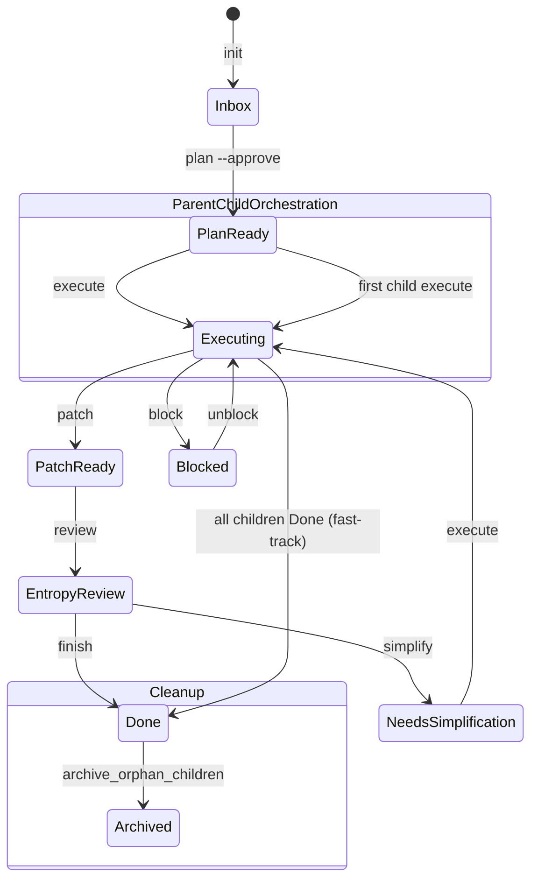

# Agent-Guard 运行时加固设计

> **Task ID**: TASK-019
> **日期**: 2026-05-18
> **作者**: Research Agent
> **范围**: 自动认领过滤、伪任务治理、Gate Sandbox 路径可靠性、父子任务生命周期闭环

---

## 背景与动机

Agent-Guard 控制平面在 TASK-018 完成后进入稳定运行，但在实际使用和代码审查中发现了 5 类运行时风险。这些问题不会立即导致崩溃，但会逐步污染 backlog、降低 Gate 可信度、并在中断恢复场景下引入不可解释的行为。

## 问题清单（全部已验证属实）

### P1: 自动认领会捞到历史伪子任务
- **现状**: `_claim_next_task()` 第 56 行已过滤 `get_children() != []` 的父任务，但历史自动拆分曾生成大量非 Task-level 伪子任务（如 `TASK-018-Step-Commit`、`TASK-018-file-changes`、`TASK-018-state-diagram`）。这些伪子任务本身没有 children，若被推进到 Plan Ready，会被自动认领。
- **证据**: `.harness/agent-guard/state/` 目录存在 28 个 TASK-018 的伪子任务，全部处于 Inbox，parent 为 TASK-018（已 Done）。
- **风险**: 自动认领迟早会捞到这些历史垃圾任务，导致 agent 执行无意义的 plan 片段。

### P2: 自动拆分 fallback 仍可能制造伪任务
- **现状**: `_split_plan_into_subtasks()` 在找不到 `Task N:` 级 section 时，会 fallback 到"中点拆分"（将 plan 对半切开生成 2 个子任务）。
- **风险**: 中点拆分很容易把 plan 的任意段落（如 `task_description`、`file_changes` 清单）切出独立的伪子任务，进一步加剧 P1。

### P3: G4/G5 的 sandbox 路径依赖运行时推断
- **现状**: `gates.py:g4_surgical_check` 和 `g5_verification_proof` 直接通过 `SandboxManager().get_sandbox(task_id)` 判断 worktree 是否存在。`get_sandbox` 内部只是检查 `.worktrees/<task_id>` 目录是否存在。
- **风险**: 如果 worktree 被手动移动、snapshot 被恢复后路径变更、或不同机器上共享 state 文件，Gate 会基于错误路径运行 git diff / verification command，导致误报或漏报。

### P4: 父任务 Done 后未完成 children 污染 registry
- **现状**: `_sync_child_completion_to_parent()` 在所有 children Done 时 fast-track 父任务到 Done，但不会清理或归档未完成的 siblings。TASK-018（Done）在 registry 中仍有 28 个 Inbox 的 children。
- **风险**: `list --recoverable`、backlog 统计、自动认领都会看到这些已失效的任务，污染运维视图。

### P5: snapshot sandbox 写入静默失败
- **现状**: `_start_execution()` 中 sandbox 信息写入 snapshot 的逻辑包裹在 `try/except: pass` 中（第 792-803 行）。如果 snapshot 文件损坏或磁盘满，worktree 路径不会被记录。
- **风险**: 后续 `resume`、`gate-check`、清理脚本都依赖 snapshot 中的 sandbox 路径，静默失败会导致中断恢复找不到 worktree。

---

## 设计原则

1. **宁可漏认，不误认**: 自动认领必须保守，来源不明的任务不应进入执行队列。
2. **单一来源**: sandbox 路径以 snapshot 中显式记录的值为准，不依赖目录存在性推断。
3. **生命周期闭环**: 父任务 Done 时，所有未完成 children 必须被显式归档，不留孤儿任务。
4. **失败有声**: snapshot 写入失败必须报警，不能静默吞掉。
5. **向后兼容**: 已有合法子任务（带 `metadata.source_plan` 的 Task-level 拆分）不受影响。

---

## 架构设计

### 状态机流转（父子任务生命周期）



### 核心组件关系

```
+-------------------+        +-------------------+        +-------------------+
| _claim_next_task  |------->| StateMachine      |------->| registry.json     |
|   (leaf filter)   |        |   list_tasks      |        |   children[]      |
+-------------------+        +-------------------+        +-------------------+
         |
         v
+-------------------+        +-------------------+
| SnapshotManager   |------->| snapshot.json     |
|   sandbox path    |        |   worktree_path   |
+-------------------+        +-------------------+
         |
         v
+-------------------+
| gates.py g4/g5    |
|   explicit cwd    |
+-------------------+
```

---

## 详细设计

### D1: 自动认领增加来源校验（解决 P1）

在 `_claim_next_task()` 的过滤链中增加两层检查：

1. **Leaf 检查**（已有）: `not sm.get_children(t.task_id)` — 排除父任务。
2. **来源检查**（新增）: 任务的 `metadata.source_plan` 必须存在且指向一个真实存在的 plan 文件。这确保只有经过 `plan --approve` 流程、有明确 plan 来源的任务才能被认领。
3. **命名检查**（新增）: 排除 task_id 匹配已知伪任务模式的条目：`r"-Step-|-file-changes$|-gate-checkpoints$|-state-diagram$|-success-criteria$|-task-description$|-test-plan$|-verification-command$"`。

```python
# _claim_next_task() 过滤链（最终）
tasks = sm.list_tasks(state_filter=State.PLAN_READY)
tasks = [t for t in tasks if not sm.get_children(t.task_id)]           # Leaf
tasks = [t for t in tasks if _has_valid_source_plan(t)]                 # Source
tasks = [t for t in tasks if not _is_pseudo_task(t.task_id)]            # Naming
tasks = sorted(tasks, key=lambda t: t.updated_at)
```

### D2: 自动拆分去除中点 fallback（解决 P2）

修改 `_split_plan_into_subtasks()`：

- 如果 plan 中找不到任何 `### Task N:` 级 section，**不再 fallback 到中点拆分**。
- 直接返回空列表，并在日志中输出警告： `"Plan has no Task-level sections; skipping auto-split. Consider breaking the plan into explicit Task sections or increasing complexity budget."`
- 调用方（`cmd_plan` 的 `--approve` 分支）在收到空列表时，保持父任务为单一任务，不创建任何子任务。

### D3: Gate 优先读取 snapshot sandbox 路径（解决 P3）

在 `gates.py` 中新增一个辅助函数 `_get_sandbox_cwd(task_id)`，优先级如下：

1. 读取 snapshot 中 `sandbox.worktree_path`。
2. 校验路径存在且是 git worktree（运行 `git rev-parse --is-inside-work-tree`）。
3. 若 snapshot 中无记录或路径无效，fallback 到 `SandboxManager._worktree_path(task_id)`。
4. 若仍无效，fallback 到当前工作目录 `.`。

```python
def _get_sandbox_cwd(task_id: str) -> str:
    """获取任务对应的 sandbox 工作目录，优先使用 snapshot 中记录的路径。"""
    from snapshot import SnapshotManager

    snap_mgr = SnapshotManager()
    try:
        snap = snap_mgr.load_snapshot(task_id)
        if snap.sandbox and snap.sandbox.worktree_path:
            path = Path(snap.sandbox.worktree_path)
            if path.exists():
                result = subprocess.run(
                    ["git", "rev-parse", "--is-inside-work-tree"],
                    capture_output=True,
                    text=True,
                    timeout=10,
                    cwd=str(path),
                )
                if result.returncode == 0 and result.stdout.strip() == "true":
                    return str(path)
    except Exception:
        pass

    from sandbox import SandboxManager
    mgr = SandboxManager()
    sandbox = mgr.get_sandbox(task_id)
    if sandbox:
        return str(mgr._worktree_path(task_id))
    return "."
```

`g4_surgical_check` 和 `g5_verification_proof` 中的 `cwd` 获取逻辑统一替换为调用 `_get_sandbox_cwd(task_id)`。

### D4: 父任务 Done 时归档未完成 children（解决 P4）

在 `cmd_finish()` 的末尾（父任务 transition 到 Done 之后），调用 `_archive_orphan_children(task_id)`：

1. 从 registry 读取所有 children。
2. 对每个 child，如果状态不是 Done，则：
   - 状态机 transition 到 Done（`skip_gates=True`，reason="Parent task completed"）。
   - snapshot 中标记为 Archived。
   - registry 中保留记录但标注 `"archived": true` 和 `"archived_reason": "parent_done"`。
3. 对于已经是 Done 的 children，保持不变。

```python
def _archive_orphan_children(parent_id: str) -> None:
    """父任务完成后，将所有未完成的子任务标记为归档。"""
    sm = StateMachine()
    snap_mgr = SnapshotManager()
    children = sm.get_children(parent_id)
    for child_id in children:
        try:
            child_task = sm.get_task(child_id)
            if child_task.current_state == State.DONE:
                continue
            sm.transition(child_id, State.DONE, skip_gates=True, reason="Parent task completed")
            try:
                child_snap = snap_mgr.load_snapshot(child_id)
                child_snap.current_state = "Archived"
                snap_mgr._write_snapshot(child_snap)
            except Exception:
                pass
            # Update registry
            registry_path = sm._registry_file()
            if registry_path.exists():
                with open(registry_path, "r", encoding="utf-8") as f:
                    registry = json.load(f)
                entry = registry.get(child_id, {})
                if isinstance(entry, str):
                    entry = {"state": entry}
                entry["state"] = State.DONE.value
                entry["archived"] = True
                entry["archived_reason"] = "parent_done"
                registry[child_id] = entry
                with open(registry_path, "w", encoding="utf-8") as f:
                    json.dump(registry, f, indent=2, ensure_ascii=False)
        except StateMachineError:
            pass
```

同时，`_claim_next_task()` 和 `list_tasks()` 增加过滤：默认排除 `archived=True` 的任务。

### D5: snapshot sandbox 写入失败报警（解决 P5）

将 `_start_execution()` 中 sandbox 信息写入 snapshot 的 `try/except: pass` 改为显式日志输出：

```python
if sandbox_info:
    try:
        from snapshot import SnapshotManager, SandboxInfo
        snap_mgr = SnapshotManager()
        snap = snap_mgr.load_snapshot(task_id)
        snap.sandbox = SandboxInfo(
            worktree_path=sandbox_info["worktree_path"],
            branch=sandbox_info["branch"],
            created_at=sandbox_info["created_at"],
        )
        snap_mgr._write_snapshot(snap)
    except Exception as e:
        print(f"[WARN] Snapshot sandbox write failed: {e}", file=sys.stderr)
        print(f"[WARN] Worktree path '{sandbox_info.get('worktree_path')}' not persisted. Resume may fail.", file=sys.stderr)
```

---

## 任务分解

### Task 1: 自动认领过滤加固

**Files:**
- Modify: `.harness/agent-guard/cli.py:43-68`（`_claim_next_task`）
- Test: `.harness/agent-guard/test_e2e.py`

- [ ] **Step 1: 写失败测试**

```python
def test_claim_skips_pseudo_tasks():
    # 创建父任务和伪子任务
    # 推进伪子任务到 Plan Ready
    # 调用 _claim_next_task，断言抛出 LeaseError（无可用任务）
```

- [ ] **Step 2: 运行测试确认失败**

Run: `pytest .harness/agent-guard/test_e2e.py::TestAgentGuardE2E::test_claim_skips_pseudo_tasks -v`
Expected: FAIL

- [ ] **Step 3: 实现来源校验和命名过滤**

在 `_claim_next_task()` 中追加 `_has_valid_source_plan` 和 `_is_pseudo_task` 两个私有辅助函数，并接入过滤链。

- [ ] **Step 4: 运行测试确认通过**

Run: `pytest .harness/agent-guard/test_e2e.py::TestAgentGuardE2E::test_claim_skips_pseudo_tasks -v`
Expected: PASS

- [ ] **Step 5: Commit**

```bash
git add .harness/agent-guard/cli.py .harness/agent-guard/test_e2e.py
git commit -m "feat(agent-guard): harden claim filter against pseudo tasks"
```

**Gate 检查点**: G3 Entropy Check（Plan Ready → Executing）

### Task 2: 去除自动拆分中点 fallback

**Files:**
- Modify: `.harness/agent-guard/cli.py`（`_split_plan_into_subtasks`）
- Test: `.harness/agent-guard/test_e2e.py`

- [ ] **Step 1: 写失败测试**

```python
def test_no_fallback_split_without_task_sections():
    # 创建一个不含 ### Task N: 的 plan
    # plan --approve，断言不创建子任务
```

- [ ] **Step 2: 运行测试确认失败**

- [ ] **Step 3: 修改 _split_plan_into_subtasks**

删除中点拆分 fallback，改为返回空列表并打印警告日志。

- [ ] **Step 4: 运行测试确认通过**

- [ ] **Step 5: Commit**

**Gate 检查点**: G1 Plan Valid / G2 Complexity Budget（Inbox → Plan Ready）

### Task 3: Gate Sandbox 路径显式化

**Files:**
- Modify: `.harness/agent-guard/gates.py`（新增 `_get_sandbox_cwd`，修改 g4/g5）
- Test: `.harness/agent-guard/test_agent_guard.py`

- [ ] **Step 1: 写失败测试**

```python
def test_get_sandbox_cwd_prefers_snapshot():
    # snapshot 记录一个有效 worktree 路径
    # _get_sandbox_cwd 应返回该路径
```

- [ ] **Step 2: 运行测试确认失败**

- [ ] **Step 3: 实现 _get_sandbox_cwd 并替换 g4/g5**

- [ ] **Step 4: 运行测试确认通过**

- [ ] **Step 5: Commit**

**Gate 检查点**: G4 Surgical Check / G5 Verification Proof（Executing → Patch Ready → Entropy Review → Done）

### Task 4: 父任务 Done 时归档未完成 children

**Files:**
- Modify: `.harness/agent-guard/cli.py`（新增 `_archive_orphan_children`，修改 `cmd_finish`）
- Modify: `.harness/agent-guard/state_machine.py`（`list_tasks` 增加 archived 过滤）
- Test: `.harness/agent-guard/test_e2e.py`

- [ ] **Step 1: 写失败测试**

```python
def test_parent_done_archives_incomplete_children():
    # 创建父任务 + 2 个子任务
    # 完成 1 个子任务，另 1 个留在 Inbox
    # finish 父任务，断言未完成的 child 被归档到 Done
```

- [ ] **Step 2: 运行测试确认失败**

- [ ] **Step 3: 实现归档逻辑**

- [ ] **Step 4: 运行测试确认通过**

- [ ] **Step 5: Commit**

**Gate 检查点**: G5 Verification Proof（Entropy Review → Done）

### Task 5: Snapshot 写入失败显式报警

**Files:**
- Modify: `.harness/agent-guard/cli.py`（`_start_execution` sandbox snapshot 写入块）
- Test: `.harness/agent-guard/test_e2e.py`

- [ ] **Step 1: 写失败测试**

```python
def test_sandbox_snapshot_write_failure_warns():
    # mock snapshot 写入抛异常
    # execute 应成功但 stderr 包含 WARN
```

- [ ] **Step 2: 运行测试确认失败**

- [ ] **Step 3: 修改 try/except 为显式日志**

- [ ] **Step 4: 运行测试确认通过**

- [ ] **Step 5: Commit**

**Gate 检查点**: G3 Entropy Check（Plan Ready → Executing）

### Task 6: 清理历史伪任务数据（一次性运维）

**Files:**
- 新增: `.harness/agent-guard/scripts/archive-legacy-tasks.py`

- [ ] **Step 1: 编写归档脚本**

```python
#!/usr/bin/env python3
"""一次性脚本：归档 TASK-018 历史伪子任务。"""
import json
from pathlib import Path
from state_machine import State, StateMachine

sm = StateMachine()
registry_path = sm._registry_file()
with open(registry_path, "r", encoding="utf-8") as f:
    registry = json.load(f)

for task_id, entry in list(registry.items()):
    if task_id.startswith("TASK-018-") and entry.get("parent") == "TASK-018":
        entry["archived"] = True
        entry["archived_reason"] = "legacy_pseudo_task"
        registry[task_id] = entry
        print(f"Archived {task_id}")

with open(registry_path, "w", encoding="utf-8") as f:
    json.dump(registry, f, indent=2, ensure_ascii=False)
```

- [ ] **Step 2: 运行脚本**

```bash
python .harness/agent-guard/scripts/archive-legacy-tasks.py
```

- [ ] **Step 3: 验证 registry**

```bash
python .harness/agent-guard/cli.py list --recoverable
# 应不再显示 TASK-018-* 伪子任务
```

- [ ] **Step 4: Commit**

```bash
git add .harness/agent-guard/scripts/archive-legacy-tasks.py
git commit -m "chore(agent-guard): archive TASK-018 legacy pseudo tasks"
```

**Gate 检查点**: 无（运维脚本，不改变 Gate 逻辑）

---

## Self-Review

1. **Spec coverage**: 全部 5 个问题（P1-P5）均有对应设计（D1-D5）和任务（Task 1-5）。Task 6 为一次性运维。
2. **Placeholder scan**: 无 TBD/TODO/占位符。每个 Task 包含完整代码和命令。
3. **Type consistency**: `archived` 字段在 registry entry 中为 bool；`current_state` 在 snapshot 中为字符串（兼容现有 Snapshot 模型）。
4. **State diagram**: 已包含 Mermaid 状态图，展示 ParentChildOrchestration 和 Cleanup 子状态。
5. **Gate checkpoints**: 每个 Task 头部标注对应的 Gate 检查点。