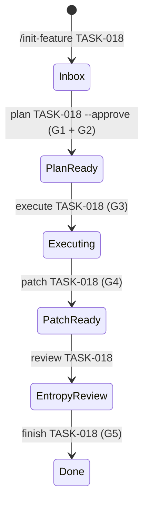

# GuardHarness 控制平面一致性修复设计

> **Task ID**: TASK-018
> **日期**: 2026-05-18
> **作者**: Research Agent
> **范围**: Agent-Guard Gate 实现、Hook 提示、CI、.gitignore、模型路由文档一致性

---

## 背景与动机

GuardHarness v2.7 在 hardened control plane 的代码更新后，出现了 6 处文档承诺与代码实现不一致的漂移。这些问题虽小，但会降低 Gate 的可信度、Hook 的完整性，以及项目的工程成熟度。

## 问题清单（全部已验证属实）

### P1: G1 Plan Valid 校验不足
- **文档/plan-schema.yaml 要求**: `state_diagram`、`gate_checkpoints`、`TDD 顺序` 为 error 级必要项
- **实际实现**: `gates.py:g1_plan_valid` 仅检查 5 个基础章节（`task_description`、`file_changes`、`test_plan`、`verification_command`、`success_criteria`），未检查 `state_diagram`、`gate_checkpoints`，也未校验 TDD 4 步顺序

### P2: G5 Verification Proof 实现单薄
- **文档承诺**: G5 覆盖"测试通过 + lint 通过 + 覆盖率达标"
- **实际实现**: `gates.py:g5_verification_proof` 仅提取 plan 中的一个 `verification_command` 并检查 exit code，不区分测试/lint/覆盖率，也不与 `finishing-policy.yaml` 联动

### P3: Slash Command Hook 与正式流程漂移
- **CLAUDE.md 要求**: 每个 slash command 执行前必须读取 `shared-axioms.md`、`standards.md`、`MEMORY.md`；执行后必须运行 Agent-Guard CLI 推进状态
- **实际实现**: `.claude/scripts/parse-slash-command.py` 注入的提示仅包含技能调用指令，缺少约束加载和 CLI 推进

### P4: 缺少 CI
- **现状**: 仓库无 `.github/workflows/`，测试、文档同步检查、安装脚本存在性验证全靠本地手动运行

### P5: 运行产物忽略规则不完整
- **实际写入**: `SandboxManager` 写 `.harness/agent-guard/patches/`；`parse-slash-command.py` 写 `.claude/scripts/hook-debug.log`
- **.gitignore 现状**: 未忽略上述路径

### P6: 模型路由配置不一致
- **model-routing.yaml**: 全部主路由为 `kimi-k2.6`
- **feature-development.md 与文档表格**: 仍硬编码 `claude-opus-4-7` / `claude-sonnet-4-6`，与权威配置矛盾

---

## 设计原则

1. **最小侵入**: 不引入新抽象类、不改动 schema 格式、不删除现有命令
2. **向后兼容**: G5 若 `finishing-policy.yaml` 缺少 `proof_of_work` 则降级为现有行为
3. **测试覆盖**: 每个代码变更必须有单元测试
4. **单一来源**: 模型路由以 `model-routing.yaml` 为唯一权威，文档只引用不硬编码

---

## 架构设计

### Agent-Guard Gate 增强

#### G1 Plan Valid 增强

在 `gates.py:g1_plan_valid` 的 `required_sections` 列表中追加两项：

```python
required_sections = [
    "task_description",
    "file_changes",
    "test_plan",
    "verification_command",
    "success_criteria",
    "state_diagram",      # 新增
    "gate_checkpoints",   # 新增
]
```

TDD 顺序校验逻辑：
- 若 plan 中存在 `file_changes` 章节且包含代码文件扩展名（`.py`、`.js` 等），则认为存在代码实现 Task
- 扫描内容是否按顺序包含以下 4 个阶段标记（正则模糊匹配）：
  1. `写.*测试|write.*test`
  2. `运行.*失败|确认.*失败|run.*fail`
  3. `写.*实现|write.*implement|最小实现`
  4. `运行.*通过|确认.*通过|run.*pass`
- 若缺少任一阶段，报 error

#### G5 Verification Proof 混合增强

保持现有 `verification_command` 执行逻辑不变，在其通过后追加 `proof_of_work` 检查：

```python
# 伪代码
g5_result = run_verification_command(task_id)
if not g5_result.passed:
    return block

# 新增：读取 finishing-policy.yaml 的 proof_of_work
pow_checks = load_proof_of_work_from_policy()
for check in pow_checks:
    result = subprocess.run(check["command"], shell=True, ...)
    if result.returncode != 0:
        return block_with_details(check["name"], result)

return pass
```

降级策略：若 `finishing-policy.yaml` 不存在或 `proof_of_work` 键缺失，跳过追加检查。

### Slash Command Hook 修正

在 `parse-slash-command.py` 的 `COMMANDS` 字典中，为每个命令的提示模板追加两段固定前缀：

**约束加载前缀**（所有命令共用）：
```
Before loading any skill, you MUST read:
1. .harness/team/shared-axioms.md
2. .harness/team/standards.md
3. .claude/memory/MEMORY.md (if exists)
```

**CLI 推进后缀**（按命令区分）：
- `/init-feature` → `python .harness/agent-guard/cli.py init TASK-xxx --spec <path>`
- `/plan-feature` → `python .harness/agent-guard/cli.py plan TASK-xxx --approve`
- `/execute-plan` → `python .harness/agent-guard/cli.py execute TASK-xxx`
- `/finish-branch` → `python .harness/agent-guard/cli.py finish TASK-xxx`
- `/fix-bug` → `python .harness/agent-guard/cli.py execute TASK-xxx`
- `/reflect` → 无 CLI 推进（reflect 不影响状态机生命周期）

### CI 配置

新增 `.github/workflows/ci.yml`：

```yaml
name: CI
on: [push, pull_request]
jobs:
  test:
    runs-on: ubuntu-latest
    steps:
      - uses: actions/checkout@v4
      - uses: actions/setup-python@v5
        with:
          python-version: '3.11'
      - run: pip install pyyaml pytest
      - run: pytest .harness/agent-guard/ -v
      - run: python .claude/scripts/check-doc-sync.py
      - run: test -f install.sh && test -f install.ps1 && test -f install.py
```

### .gitignore 追加

```
.harness/agent-guard/patches/
.claude/scripts/hook-debug.log
```

### 模型路由一致性

修改 `.harness/workflows/feature-development.md` 的 Agent Roles 表格：

```markdown
| 角色 | 模型 | 职责 |
|:---|:---|:---|
| Planner | {{ model_routing.planner.primary }} (当前: kimi-k2.6) | 需求分析、规格扩展、验收标准定义 |
| Generator | {{ model_routing.generator.primary }} (当前: kimi-k2.6) | 代码实现、测试编写 |
| Evaluator | {{ model_routing.evaluator.primary }} (当前: kimi-k2.6) | 质量评估、测试验证、反馈循环 |
```

在 `README.md` 和 `HARNESS_USAGE_GUIDE.md` 的模型路由表格下添加注释：
> 实际模型选择以 `.harness/workflows/model-routing.yaml` 为准，上表仅为示例。

---

## 文件变更清单

| 文件 | 变更类型 | 说明 |
|:---|:---|:---|
| `.harness/agent-guard/gates.py` | 修改 | G1 追加 state_diagram/gate_checkpoints/TDD 顺序检查；G5 追加 proof_of_work 联动 |
| `.harness/agent-guard/test_agent_guard.py` | 修改 | 补充 G1 新检查项的单元测试、G5 proof_of_work 联动测试 |
| `.claude/scripts/parse-slash-command.py` | 修改 | 提示模板追加约束加载 + CLI 推进 |
| `.claude/scripts/test_parse_slash_command.py` | 新增 | Hook 提示内容单元测试 |
| `.github/workflows/ci.yml` | 新增 | GitHub Actions CI 配置 |
| `.gitignore` | 修改 | 追加 patches/ 和 hook-debug.log |
| `.harness/workflows/feature-development.md` | 修改 | 模型名改为引用 model-routing.yaml |
| `README.md` | 修改 | 模型路由表格添加注释 |
| `HARNESS_USAGE_GUIDE.md` | 修改 | 模型路由表格添加注释 |

---

## Agent-Guard 状态图



## Gate 检查点

| Task | Gate |
|:---|:---|
| G1 增强实现 | G1 Plan Valid（自举验证） |
| G5 增强实现 | G4 Surgical Check |
| Hook 修正 | G4 Surgical Check |
| CI 配置 | G5 Verification Proof |
| .gitignore 更新 | G4 Surgical Check |
| 模型路由一致性 | G4 Surgical Check |

---

## 验证标准

- [ ] `pytest .harness/agent-guard/ -v` 全部通过
- [ ] `python .claude/scripts/check-doc-sync.py` 通过
- [ ] G1 对缺少 `state_diagram` 的 plan 返回 `passed: false`
- [ ] G1 对缺少 TDD 顺序的 plan 返回 `passed: false`
- [ ] G5 在 `finishing-policy.yaml` 存在 `proof_of_work` 时运行额外检查
- [ ] `parse-slash-command.py` 输出的 JSON 包含约束加载和 CLI 推进文本
- [ ] `.github/workflows/ci.yml` 在 push/PR 时触发并成功
- [ ] `.gitignore` 生效，`git status` 不显示 patches/ 和 hook-debug.log
- [ ] `feature-development.md` 不再硬编码 claude-opus-4-7

---

## 风险与回滚

| 风险 | 缓解 |
|:---|:---|
| G1 新增检查导致旧 plan 不通过 | 仅影响新 plan，旧任务已处于 Executing/Done 状态不受 G1 影响 |
| G5 proof_of_work 读取失败 | 已设计降级策略：缺失时跳过，保持现有行为 |
| Hook 提示过长 | 测试验证 JSON 长度在合理范围内（< 4KB） |
| CI 首次运行失败 | 可在 PR 中迭代修复 workflow 文件 |

---

*设计确认后进入计划阶段。*
